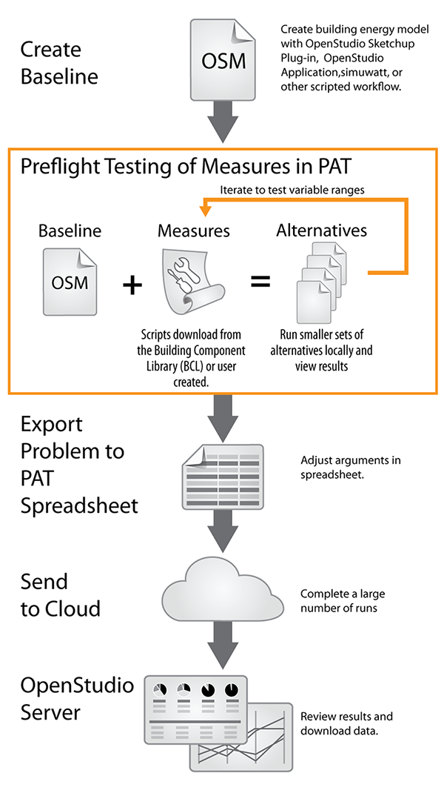
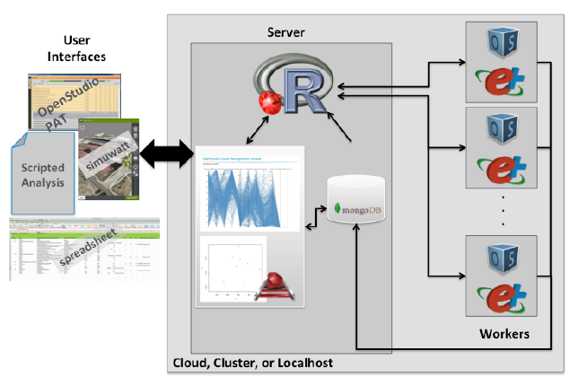

## Large-Scale Analysis
###About
The ParametricAnalysisTool (PAT) now exports a spreadsheet format compatible with the OpenStudio-analysis-spreadsheet project for running large parametric analyses using cloud resources.

Go to the Github repository for information and code for the analysis spreadsheet.](https://github.com/NREL/OpenStudio-analysis-spreadsheet) There are instructions and examples on the GitHub site.

The Workflow:

1. Build your baseline model with the OpenStudio Application
2. Manipulate the Model with measures
3. Run basic parametrics via PAT
4. Export a spreadsheet view from PAT
5. Fill in ranges, distributions, defaults, algorithms, objective functions
6. Large Analyses via OpenStudio-Server
7. Start Cluster
8. Upload Data:
      * Measures
      * Variables
      * Seed Model
      * Weather Data
9. Simulation Executive Runs Analysis
10. Browse Results and Download Files
11. Everything has an JSON-based API to access data programmatically
12. Download results in CSV or R dataframe

__________

__________

### Starting OpenStudio's Cloud

    $ gem install bundler
    $ git clone https://github.com/NREL/OpenStudio-analysis-spreadsheet.git
    $ bundle install
    
### Export Spreadsheet
Select the measures you want to use in the analysis and export a spreadsheet by selecting that option under the File menu.

        
### Edit the Template Spreadsheet
After exporting the spreadsheet from PAT, open the spreadsheet in Excel to edit fields.

### Running OpenStudio's Cloud

    $ rake run

__________

### Buildings Specific Chef Cookbooks
Provisioning provides assures that the appropriate tools are ready on the server, there are consistent images across platforms, and to make it easier to test and deploy.

The OpenStudio Server uses Chef to help automate the workflow. 
[Chef Documentation](https://docs.getchef.com/chef_overview.html)

OpenStudio - [https://github.com/NREL-cookbooks/openstudio](https://github.com/NREL-cookbooks/openstudio)

EnergyPlus - [https://github.com/NREL-cookbooks/energyplus](https://github.com/NREL-cookbooks/energyplus)

Radiance - [https://github.com/NREL-cookbooks/radiance](https://github.com/NREL-cookbooks/radiance)

R - [https://github.com/NREL-cookbooks/cookbook-r](https://github.com/NREL-cookbooks/cookbook-r)

__________

### Server Architecture

Read the paper on the development of this process, [SCALING BUILDING ENERGY MODELING HORIZONTALLY IN THE CLOUD WITH OPENSTUDIO (PDF).](https://www.ashrae.org/File%20Library/docLib/Events/ASHRAE-IPBSA-USA/Presentations/11_Long.pdf)

_______________________

<small>OpenStudio is developed in collaboration by NREL, ANL, LBNL, ORNL, and PNNL.</small>
 

<small>NREL is a National Laboratory of the U.S. Department of Energy, Office of Energy Efficiency and Renewable Energy, operated by the Alliance for Sustainable Energy, LLC.</small>

  

