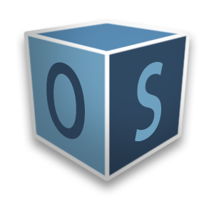
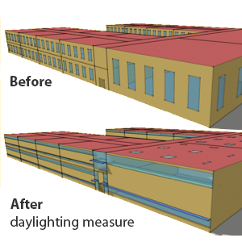

<h1>Welcome to OpenStudio User Documentation</h1>

This is OpenStudio's user documentation. A brief summary of the content and intent of each section is below. Use the buttons below or the horizontal navigation above to learn more about the OpenStudio suite of applications.

  

    

      
 
        

          <h3>Getting Started</h3>
          
This section provides installation instructions, Building Component Library (BCL) key instructions, introductory tutorials, and licensing information to get you up and running.

          
<a href="getting_started/getting_started.md" class="btn btn-primary" role="button">Installation &amp; Tutorial</a>

          
Review the list of features and building elements that can be modeled.

          
<a href="getting_started/features.md" class="btn btn-primary" role="button">Current Features</a>

          
<a href="getting_started/roadmap.md" class="btn btn-primary" role="button">Planned Features</a>

        

      

    

    

      
 
        

          <h3>References &amp; Tutorials</h3>
          
This section provides more detailed information on OpenStudio features and contains tutorials and other references.

          
<a href="next_steps/sketchup_plugin_interface.md" class="btn btn-primary" role="button">SketchUp Plug-in</a>

          
<a href="next_steps/openstudio_application_interface.md" class="btn btn-primary" role="button">OpenStudio Application</a>

          
<a href="next_steps/creating_your_model.md" class="btn btn-primary" role="button">Creating Your Model</a>

          
<a href="next_steps/running_your_simulation.md" class="btn btn-primary" role="button">Running Your Simulation</a>

        

      

    

    

      
 
        

          <h3>Speed Up Your Workflow With Measures</h3>
          
Learn what measures are, how to use them for various use cases, and where to find them.

          
<a href="measures/about_measures.md" class="btn btn-primary" role="button">About Measures</a>

          
Can't find the measures you want, or need to customize an existing measure? The Measure Writing Guide will help you get started.

          
<a href="measures/measure_writing_guide.md" class="btn btn-primary" role="button">Measure Writing Guide</a>

        

      

    

  

  

    

      
 
        

          <h3>Comparative Analysis</h3>
          
Learn how to create design alternatives as part of a parametric study using the OpenStudio ParametricAnalysisTool (PAT). Run simulations locally and on the cloud.

          
<a href="comparative_analysis/parametric_studies.md" class="btn btn-primary" role="button">ParametricAnalysisTool (PAT)</a>

          
<a href="comparative_analysis/large_scale_analysis.md" class="btn btn-primary" role="button">Large Scale Analysis</a>

        

      

    

    

      
 
        

          <h3>Help</h3>
          
Find professional training for OpenStudio.

          
<a href="help/training.md" class="btn btn-primary" role="button">Training, Support, &amp; Consulting</a>

          
Additional help topics.

          
<a href="help/finding_model_data.md" class="btn btn-primary" role="button">Finding Model Data</a>

          
<a href="help/best_practices.md" class="btn btn-primary" role="button">Best Practices</a>

          
<a href="help/troubleshooting.md" class="btn btn-primary" role="button">Troubleshooting</a>

          
<a href="help/faq.md" class="btn btn-primary" role="button">FAQ</a>

          
<a href="https://unmethours.com/questions/scope:all/sort:activity-desc/tags:openstudio/" class="btn btn-primary" role="button">Get Help</a>

        

      

    

    

      

        

          <h3>Additional Resources.</h3>
          
Check out Unmet Hours a Question-and-Answer Resource for the Building Energy Modeling Community.

          
<a href="https://unmethours.com/questions/scope:all/sort:activity-desc/tags:openstudio/" class="btn btn-primary" role="button">Unmet Hours</a>

          
More training videos are available on our YouTube page.

          
<a href="http://www.youtube.com/channel/UC5NGj39XfJkhYUfCtKr-r_w/questions/" class="btn btn-primary" role="button">YouTube Videos</a>

          
Additional Resources.

          
<a href="http://github.com/NREL/OpenStudio" class="btn btn-primary" role="button">Code on GitHub</a>

        

      

    

  

