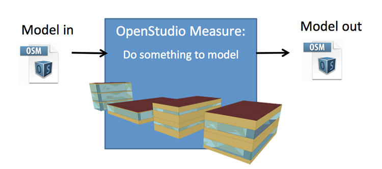
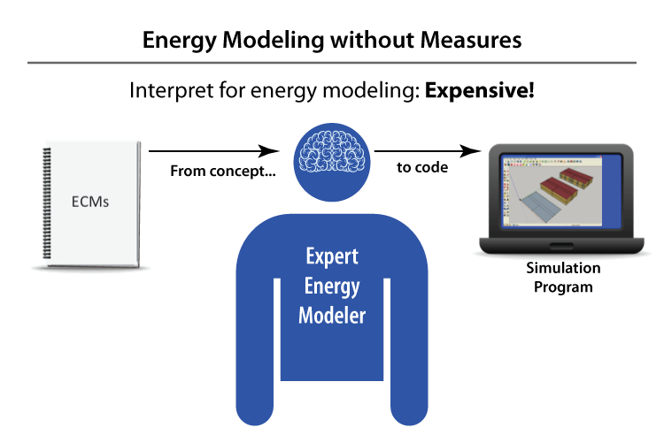
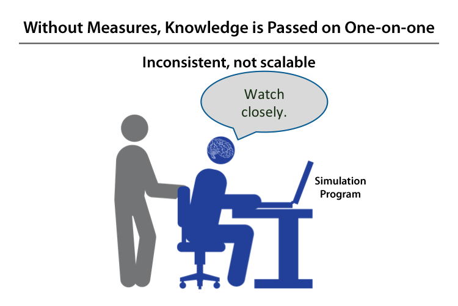
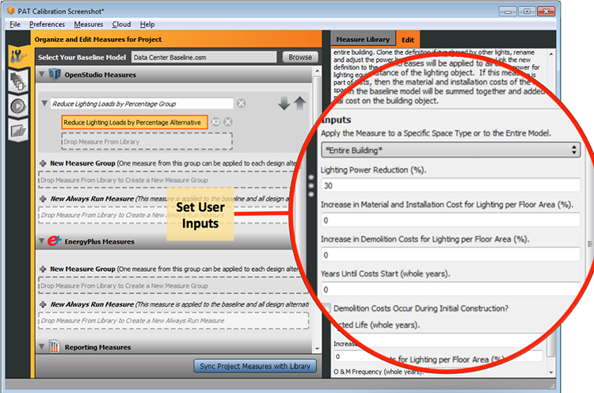

# About Measures
_________________

## What Are Measures?
In building design and retrofits, the terms energy efficiency measure (EEM) and energy conservation measure (ECM) refer to a specific change that can be made to a building to reduce its energy use. As an example, imagine that you are retrofitting an existing building and one of the ECMs suggested by the design team is "Add insulation to the roof."

In OpenStudio, a measure is a set of programmatic instructions (such as an Excel macro) that makes changes to an energy model to reflect its application. In our example, the measure might find the default construction used by roof surfaces in the model, copy this construction and add insulation material to the outside, then set the new construction with added insulation as the default construction to be used by roof surfaces. Measures can be written specifically for an individual model, or they may be more generic to work on a wide range of possible models.

__EE Measures__

* Add something 
* Remove something
* Change something

__QA/QC Measures__

* Compute something
* Report something

*Above: Examples of EE alterations to the model using measures.*

_________________

## Benefits of Measures
__Measures can help energy modelers by:__

* Reducing modeling time and cost
* Finding deeper savings
* Lowering administrative and training costs
* Maintain quality and consistency

_________________

## Types of Measures

* Model Measures
  * Bar Aspect Ratio Study
  * Reduce Lighting Loads by Percentage
  * Shift Schedule Profile Time
* Energy Plus Measures
  * Add Simple PV to Sharing Surfaces By Type
* Reporting Measures
  * Annual End Use Breakdown
  
_________________

## How Do you Use Measures?
### Apply Measures Now
### OpenStudio Application Measures Tab
### Parametric Analysis Tool
In the ParametricAnalysisTool (PAT) you first drag all the measures you will us into your project and edit them to have the desired inputs. On the second tab you create the design alternatives using the measures you set up on the first tab.

*Above: Measures can be added by dragging and dropping them into your project in both the OpenStudio Application and in PAT.*

*Above: Edit the measure inputs by selecting the measure and going to the right panel "Edit" tab.*

* Command Line

_________________

## Where Do you find Measures.
### Building Component Library (BCL)
You can find measures by going directly to the [BCL site](https://bcl.nrel.gov/) and searching or browsing for measures.

Measures can be downloaded directly from BCL through the [OpenStudio Application](/../next_steps/openstudio_application_interface/#components-measures-menu) and [PAT](/../comparative_analysis/ParametricStudies/#downloading-measures-from-the-building-component-library) as well.

### Locally Shared Measures

### Create Your Own
Want to write your own custom measure? Start with the [Measure Writing Guide](Measure-Writing-Guide.md).

