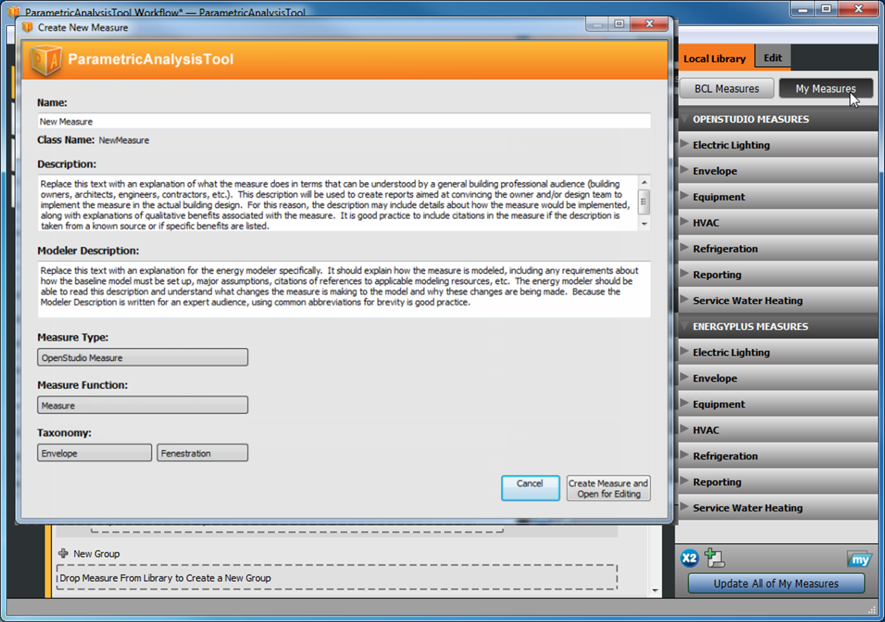

# Measure Writing Guide

## Contents
1. [What Is a Measure?](#1-what-is-a-measure)
2. [Understanding This Guide](#2-understanding-this-guide)
3. [The Programmatic Instructions - measure.rb](#3-the-programmatic-instructionsmeasurerb)
    1. [Starting and Ending the Measure](#31-starting-and-ending-the-measure)
    2. [Name](#32-name)
    3. [Arguments](#33-arguments)
        1. [Possible Types of Arguments](#331-possible-types-of-arguments)
        2. [Defaults and Required Arguments](#332-defaults-and-required-arguments)
    4. [Run](#34-run)
        1. [Input Validation](#341-input-validation)
        2. [Info, Warning, and Error Messages](#342-info-warning-and-error-messages)
        3. [Input Validation (Continued)](#343-input-validation-continued)
        4. [Making Changes to the Model](#344-making-changes-to-the-model)
        5. [Optionals and .get](#345-optionals-and-get)
        6. [Info, Warning, and Error Messages (Continued)](#346-info-warning-and-error-messages-continued)
        7. [What Methods Are Available?](#347-what-methods-are-available)
    5. [Putting It All Together](#35-putting-it-all-together)
4. [The Name and Description - measure.xml](#4-the-name-and-descriptionmeasurexml)
    1. [Starting and Ending measure.xml](#41-starting-and-ending-measurexml)
    2. [Naming the Measure](#42-naming-the-measure)
    3. [Unique Identifier and Version Identifier](#43-unique-identifier-and-version-identifier)
    4. [Description](#44-description)
    5. [Modeler Description](#45-modeler-description)
    6. [Provenance](#46-provenance)
    7. [Tags](#47-tags)
        1. [BCL Measures Taxonomy](#471-bcl-measures-taxonomy)
    8. [Attributes](#48-attributes)
        1. [Measure Type](#481-measure-type)
        2. [Measure Function](#482-measure-function)
        3. [Requires EnergyPlus Results](#483-requires-energyplus-results)
        4. [Uses SketchUp API](#484-uses-sketchup-api)
    9. [Files](#49-files)
    10. [Putting It All Together](#410-putting-it-all-together)
5. [Advanced EnergyPlusMeasures - Edit .idf Files Directly](#5-energyplusmeasures--edit-idf-files-directly)
    1. [Finding and Inspecting EnergyiPlus Objects](#51-finding-and-inspecting-energyplus-objects)
    2. [Adding EnergyPlus Workspace Objects](#52-adding-energyplus-workspace-objects)
    3. [Editing EnergyPlus Workspace Objects](#53-editing-energyplus-workspace-objects)
    4. [Finding Documentation on EnergyPlus Objects](#54-finding-documentation-on-energyplus-objects)
    5. [Putting It All Together - A Complete WorkspaceUserScript](#55-putting-it-all-together--a-complete-workspaceuserscript)
6. `NEW` [Output Attributes](#6-output-attributes)

## 1. What is a Measure?
In building design and retrofits, the terms *energy efficiency measure* (EEM) and *energy conservation measure* (ECM) refer to a specific change that can be made to a building to reduce its energy use.  As an example, if you are retrofitting an existing building and one of the ECMs suggested by the design team is "Add insulation to the roof," then you can run that measure to quickly alter your model.

In OpenStudio, a measure is a set of programmatic instructions (such as an Excel macro) that makes changes to an energy model to reflect its application.  In our example, the measure might find the default construction used by roof surfaces in the model, copy this construction and add insulation material to the outside, then set the new construction with added insulation as the default construction to be used by roof surfaces.  Measures can be written specifically for an individual model, or they may be more generic to work on a wide range of possible models.

## 2. Understanding this Guide
Each OpenStudio measure is contained in its own folder (usually named after the measure) and contains two key files:

- measure.rb (contains the programmatic code to change the building mode)
- measure.xml (contains information about the measure that allows other people to search for and find it).

The measure may also contain tests to ensure that it works correctly and resources which are other files that the measure uses during its operation.  This file structure allows OpenStudio to easily share and use measures.


This guide is directed primarily toward measure authors; some instructions also apply to users.

This guide explains the purpose of each of these files and walks through their contents step-by-step to help you create your own measures.  The programming instructions for each measure are written in a programming language called Ruby (http://www.ruby-lang.org/en/).  If you are unfamiliar with the basic concepts of computer programming, it would be wise to acquire some background (preferably in the Ruby language, http://tryruby.org) before proceeding.  That said, the Ruby code in these examples is simple, so anyone familiar with basic programming concepts (variables, loops, etc.) should be able to read this guide with little difficulty.

The types of files we discuss can be opened in a text editor (notepad++ is a free editor that works well for these examples, http://notepad-plus-plus.org/).  File content appears in boxes to differentiate it from the rest of the text.  Ellipses (...) represent code that was removed because it is not relevant to the current discussion.

```
a = 5
...

```

## 3. The Programmatic Instructions—measure.rb
The measure.rb file contains the Ruby program that allows the measure to make changes to the input model.  The bulk of the work done when writing a measure lies in editing this file.  The measure.rb file includes the beginning and end of the measure; the content of the measure is then divided into three general sections:  name, arguments, and run.  The following sections explain each section.

### 3.1. Starting and Ending the Measure
Generally, each measure is a variation of an OpenStudio ModelUserScript.  You do not need to worry about what this means right now; we will explain the details later.  The important point is that the text below starts and ends a measure.  The class name for the measure (in light blue) is user defined. The same class name appears again on the last line where a new instance of the class is instantiated and registered with OpenStudio.  It is good practice to use UpperCamelCase (CapitalizeTheFirstLetterOfEveryWord) for your class name.  This must be a valid class name in Ruby; it must start with an uppercase letter and cannot contain spaces or other special characters.  Everything else about the measure (name, arguments, and run) will be inserted where the ellipsis is.

```ruby
class AddInsulationToRoof < OpenStudio::Ruleset::ModelUserScript
  ...
end

AddInsulationToRoof.new.registerWithApplication
```

### 3.2. Name
Inside this method, you describe the measure name, which should be written such that another building professional (architect, engineer, etc.) can understand what the measure will do. The name in the XML file (described later) is used for the display in the Parametric Analysis Tool; it is a good practice to use the same name here.

```ruby
def name
  return "Add Insulation to the Roof"
end
```

### 3.3. Arguments
Inside this method, you describe which, if any, input parameters the user should be able to change before running the measure.  In the example "Add insulation to the roof," you might want the user to specify the thickness of the insulation along with the R-value per inch of thickness.  When a measure has input parameters that the user can edit, the user can change the input values to perform a parametric analysis to answer "what-if" questions and find the best option.

The arguments section opens and closes as follows:

```ruby
def arguments(model)
  args = OpenStudio::Ruleset::OSArgumentVector.new
  ...
  return args
end
```

On the first line, you start the method and pass in the model, in case the arguments presented to the user are model dependent.  For example, if the user can only choose from air loops in the model, you should present only valid air loop names.  The second line sets the variable that will hold the arguments the user can edit.  The last line passes these arguments back to the user to fill out.

In our example, you might want to give the user two inputs:  insulation thickness and R-value per inch of insulation.  The argument for insulation thickness would look like this:

```ruby
insl_thckn = OpenStudio::Ruleset::makeDoubleArgument('insl_thckn',true)
insl_thckn.setDisplayName('Insulation Thickness (in)')
insl_thckn.setDefaultValue(1.5)
args << insl_thckn
```

The first line is a command to create a new argument of the type double (more on the arguments types later) and assign it to the variable "insl_thckn".  The "true" at the end of this line indicates that the argument is required; "false" indicates that the argument is not required.  On the second line, the display name of the argument is set.  The user will see this in the graphical user interface (GUI).  It is good practice to identify the units of the argument inside parentheses at the end of the display name so the user knows what value to input.  On the third line, you specify the default value for the argument.  This default value is presented initially to the user, but the user can change the value in the GUI.

#### 3.3.1. Possible Types of Arguments
You can create a few types of arguments

##### Double
A double argument is any real number such as 1.0, –1.5, or 50.5.

```ruby
v1 = OpenStudio::Ruleset::OSArgument::makeDoubleArgument('v1', false)
```

##### Integer
An integer argument is any real whole number such as 1, –2, or 51.

```ruby
v2 = OpenStudio::Ruleset::OSArgument::makeIntegerArgument('v2', false)
```

##### Boolean (Bool)
A boolean argument gives the user the choices of true or false.

```ruby
v3 = OpenStudio::Ruleset::OSArgument::makeBoolArgument('v3', false)
```

##### String
A string argument allows the user to input text.

```ruby
v4 = OpenStudio::Ruleset::OSArgument::makeStringArgument('v4', false)
```

##### Choice
A choice argument allows you to limit the user to picking from a set list of options.  For the choice argument, you must create the choices and pass them into the argument.

```ruby
chs = OpenStudio::StringVector.new
chs << "Option 1"
chs << "Option 2"
v5 = OpenStudio::Ruleset::OSArgument::makeChoiceArgument('v5', chs, true)
```

Possible values for the choice arguments can also be extracted from the model.  For example, the following would give the user a choice of any zones in the model, by zone name.

```ruby
v6 = OpenStudio::Ruleset::makeChoiceArgumentOfWorkspaceObjects
          ("v6","OS_Thermal_Zone".to_IddObjectType,model,true)
```

#### 3.3.2. Defaults and Required Arguments
When deciding how to ask the user for each input, you should consider whether the input is required and whether there is a reasonable default value.  Required arguments are inputs that the measure needs to run, such as the lighting level for each space.  Non-required arguments are optional, but you must make clear to the user what will happen if no value is provided.  Default values may be based on current best practices (e.g., current lighting power reductions to 0.8 W/ft2 are possible), or they may be chosen specifically for the model (e.g., choose the most common space type for adjusting the lighting power).  Where the argument is not required but there is a good default, it is good practice to set the argument to be required anyway, as there is no burden on the user to provide any input.

| Required? | Has a Default? | Best Practice?     |
|-----------|----------------|--------------------|
| Yes       | Yes            | Yes                |
| Yes       | No             | Yes                |
| No        | Yes            | No                 |
| No        | No             | Must be documented |

### 3.4. Run
The run method is where all the magic happens.  This is where you write the programmatic instructions that take the user inputs and change the energy model in specific ways.  This method has more pieces than the name or arguments method.  We explain each piece separately, and then show all the pieces together.

The run method starts much like the other methods:

```ruby
def run(model, runner, user_arguments)
  super(model, runner, user_arguments)
  ...
  return true
end
```

The super line is boilerplate; it is necessary, but you do not need to worry about how it works. Just before the end to the run method there should be a "return true" line.  If a measure does not return "true," OpenStudio will think that the measure failed and the simulation workflow will stop.

#### 3.4.1. Input Validation
When the user applies a measure to a model, he or she first fills in the inputs the author exposed in the arguments method.  Because the user may have entered bad values, you first need to validate the input in the run method.  For example, the user may have indicated that the building is 1 ft long instead of 100 ft long, or the input asked for an integer and the user input 2.5.  Regardless, you must check the inputs before moving forward.

The first step is to make sure that each required argument appears, has a value, and the value is the right type (strings are strings, doubles are doubles, etc.).  This part of the error checking is built into OpenStudio and is shown below.  If the argument fails to validate, this built-in method will give the user specific error messages that describe the problem.  The second line is "return false."  This tells the run method to stop here; "false" indicates that the measure's run method did not complete successfully.

```ruby
if not runner.validateUserArguments(arguments(model), user_arguments)
  return false
end
```

Assuming that all the required inputs are present and have the right kinds of values, you next need to ensure that values make sense in the context of the script.  For example, –2 is a valid integer, but it is not a valid number of chillers in a building.

The first step in this type of error checking is to pull the values from the "user_arguments" variable and assign them to variables in the run method.  Best practice is to use the same variable names in the arguments method and the run method.

```ruby
v1 = runner.getDoubleArgumentValue('v1',user_arguments)
v2 = runner.getIntegerArgumentValue('v2',user_arguments)
v3 = runner.getBoolArgumentValue('v3',user_arguments)
v4 = runner.getStringArgumentValue('v4',user_arguments)
v5 = runner.getStringArgumentValue('v5',user_arguments)
v6 = runner.getOptionalWorkspaceObjectChoiceValue('v6',user_arguments, model)
```

Now that the user inputs have been assigned to variables, you need to check the validity of each value.  If you encounter a problem, you need a way to let the user know what happened (and how to fix it).  We will now take a brief detour to explain how you can pass this type of information back to the user.  We will then continue on with input validation.

#### 3.4.2. Info, Warning, and Error Messages
You can send three types of messages to the user from the measure.  These messages will be shown in the GUI when the measure is run.  You can thus let the user know something, but does not need to force the user to go into obscure error and output files.  Each message has a specific purpose.  The messages below are short for clarity; however, there is no limit to the length of the messages passed.  Best practice messages will be concise, yet specific enough that the user knows exactly where to go to address any issue.

##### Info Messages
Info messages simply let the user know what happened as the measure was running.  Info messages do not cause the measure to fail or stop running.  In our example of "Add insulation to roof," you might decide to tell the user the number of surfaces to which insulation was added.  In Ruby, inserting "#{num_surfaces}" in the message tells Ruby to convert the value of the variable "num_surfaces" to a string and substitute the result into the message.

```ruby
runner.registerInfo("Added insulation to #{num_surfaces} surfaces.")
```

##### Warning Messages
Warning messages enable you to warn the user about something that may be critical to the assumptions or that significantly affects how the measure runs.  Warning messages do not cause the measure to stop running.  In our example of "Add insulation to roof," you might want to warn the user if the insulation thickness entered exceeds 12 inches, because adding more than 12 inches of insulation is unusual but not unheard of.

```ruby
runner.registerWarning("#{insul_thckns} inches of insulation seems high.")
```

##### Error Messages
Error messages are used when the measure simply cannot continue.  Perhaps the user entered
–1.5 for a fractional schedule value.  Error messages stop the measure from running.  Error messages should point the user to the specific error and suggest a way to fix or avoid it.  The measure should return "false" and issue an error message:

```ruby
runner.registerError("v1 must be greater than or equal to 0 and less than or equal to 1.  You entered #{v1}.")

return false
```

#### 3.4.3. Input Validation (Continued)
Now that we have covered how to send information messages back to the user, we will continue discussing how to validate the input.  In this first example, we assume that v1 is a fractional value; therefore, it must be between 0 and 1.

```ruby
if v1 < 0 or v1 > 1
  runner.registerError("v1 must be greater than or equal to 0 and less than or equal to 1.  You entered #{v1}.")
  return false
end
```

This error checking is performed with a Ruby if statement.  If the input check test fails,  an error message is registered, and then the measure's run method returns "false," stopping the measure from continuing.

Input validation can be as simple or as detailed as the situation requires.  The goal is to catch any bad inputs before wasting time making nonsensical changes to the model and alert the user of the problem so it can be corrected as quickly as possible.

#### 3.4.4. Making Changes to the Model
Once all the inputs have been checked, it is time to start doing something to the model.  A vast number of possible changes can be made, so rather than describing each one, this section gives a few examples and explains how to determine which commands to use to do other things.

The goal of the first example will be to loop through all the spaces in the model and check whether the space is assigned to a thermal zone.  If it not assigned to a thermal zone, you need to create a new thermal zone and assign this space to it.

```ruby
def run(model, runner, user_arguments)
  super(model,runner,user_arguments)
  spaces = model.getSpaces

  spaces.each do |space|
    if space.thermalZone.empty?
      new_thermal_zone = OpenStudio::Model::ThermalZone.new(model)
      space.setThermalZone(new_thermal_zone)
      runner.registerInfo("Space #{space.name} didn't have a thermal zone,
                          so a new thermal zone was created and assigned.")
    end
  end

end
```

The first command is to get all the spaces in the model.  Whenever you want a vector of a certain class of objects from a model, the command is "get#{ClassName}s" (e.g., getThermalZones, getSpaces).  Next you start a loop that iterates through all spaces in the model. Within this loop the next command checks to see if the space has a thermal zone assigned.  Now you begin to get into the programming weeds… be patient, this is one of the hardest parts to understand.

#### 3.4.5. Optionals and .get
OpenStudio is written in C++, and translated to be available in Ruby by software called SWIG.  This auto-translation leaves one artifact that Ruby users generally do not deal with:  the "optional" return type.

Some OpenStudio methods return an "OptionalSomething" (Ruby hint: if you ever want to know the type of a variable in Ruby, you can use the ".class" method to find out).  An optional result is either empty (the method did not return anything) or it points to what you are trying to get.  Look at the example line.

```ruby
if space.thermalZone.empty?
```

In the online [documentation](http://openstudio.nrel.gov/sites/openstudio.nrel.gov/files/nv_data/cpp_documentation/model/html/classopenstudio_1_1model_1_1_space.html) for the "Space" object, the method ".thermalZone" is defined as:

boost::optional<[ThermalZone](http://openstudio.nrel.gov/sites/openstudio.nrel.gov/files/nv_data/cpp_documentation_it/model/html/classopenstudio_1_1model_1_1_thermal_zone.html)> openstudio::model::Space::thermalZone( ) const

This indicates that calling "space.thermalZone" returns a "boost::optional< [ThermalZone](http://openstudio.nrel.gov/sites/openstudio.nrel.gov/files/nv_data/cpp_documentation_it/model/html/classopenstudio_1_1model_1_1_thermal_zone.html) >" result.  Ignoring the syntax for now, the main point is that the method returns an "OptionalThermalZone" and not a "ThermalZone".  To learn whether this "OptionalThermalZone" points to an actual "ThermalZone," you use the ".empty?" method.  If the result is empty, it does not point to an actual "ThermalZone" and cannot be used.  In the example if "space.thermalZone.empty?" is true, the space has no thermal zone. Calling "get" on an empty "OptionalSomething" will crash the measure.

If an "OptionalSomething" is not empty, it points to an actual "Something" and can be used.  To get the actual "Something" that the variable points to, you can use the ".get" method.  In the example if "space.thermalZone.empty?" is not true, you can use ".get" to get a reference to the space's thermal zone.

```ruby
if not space.thermalZone.empty?
  thermal_zone = space.thermalZone.get
end
```

The OpenStudio API has many places where optional results are returned.  The API documentation can be very helpful for determining the type of result a given method returns.  Several methods in OpenStudio return a "ModelObject" (".clone", ".optionalWorkspaceObjectChoiceValue", etc.).  This is fine for many purposes; however, if you want to test if the object returned is of a particular type (e.g., is it a Space or a SpaceType), you will have to try converting the object to those types using the ".to_#{ClassName}"  (".to_Space", ".to_SpaceType", etc).  Those methods will return an optional result, which will be empty if the conversion failed and will contain the value if it succeeded. If the conversion was successful, you can use all the methods of that type on the result.

```ruby
new_object = old_object.clone(model)
if not new_object.to_LightsDefinition.empty?
  #what you cloned was a LightsDefinition
  new_light_def = new_object.to_LightsDefinition.get
else
  #what you cloned was not a LightsDefinition
end
```

Don't worry if you did not understand all this on the first pass, keep going forward and look at the next example, referring back as needed.

#### 3.4.6. Info, Warning, and Error Messages (Continued)
Beyond the info, warning, and error messages that you can give to the user, three other specific pieces of information can be returned:  the initial condition, the final condition, and whether the measure was applicable to this particular model.

##### Initial Condition
The initial condition is a way for you to give the user a "before" snapshot of the model with respect to what the measure will change.  Reporting the initial condition is optional, but is good practice.

```ruby
runner.registerInitialCondition("Model started with #{num_flrs} floors")
```

##### Final Condition
The final condition is a way for you to give the user an "after" snapshot of the model with respect to what the measure changed.  Reporting the final condition is optional, but is good practice.  The initial and final conditions can be useful when explaining the specific changes the measure made to the model.

```ruby
runner.registerFinalCondition("Model ended with #{num_flrs} floors")
```

##### Not Applicable
Not all measures are applicable to all models.  For example, a measure called "Replace all windows with triple-paned windows" would not be applicable to a building with no windows.  The fact that a measure ran successfully, but made no changes to the model, should be recorded.  Imagine that the user applied the example measure to many buildings and looked at its impact across all the buildings.  For the building with no windows, the measure was "Not Applicable", so the user could therefore exclude this building from the impact analysis.  It is good practice to track whether a measure makes any changes to the model, and register it as "Not Applicable" if no changes were made.

```ruby
runner.registerAsNotApplicable("Measure not applicable because XYZ")
return true
```

This extended example shows how the initial condition, final condition, and applicability flags are used.

```ruby
def run(model, runner, user_arguments)
  super(model,runner,user_arguments)
  spaces = model.getSpaces

  num_spcs_with_tz = 0
  num_spcs_no_tz = 0
  num_tzs_created = 0

  spaces.each do |space|
    if space.thermalZone.empty?
      num_spcs_no_tz += 1
      new_thermal_zone = OpenStudio::Model::ThermalZone.new(model)
      num_tzs_created += 1
      space.setThermalZone(new_thermal_zone)
      runner.registerInfo("Space #{space.name} didn't have a thermal zone,
                          so a new thermal zone was created and assigned.")
    else
      num_spcs_with_tz += 1
    end
  end

  runner.registerInitialCondition("The model had #{num_spcs_with_tz}
                                  spaces with a thermal zone and
                                 #{num_spcs_no_tz} without a thermal zone")

  runner.registerFinalCondition("#{num_tzs_created} thermal zones were
                                 created. All spaces now have a thermal
                                 zone")

  if num_tzs_created == 0
    runner.registerAsNotApplicable("Not applicable because all spaces
                                    already had thermal zones")
  end

  return true
end
```

#### 3.4.7. What Methods Are Available?
After looking at the examples above, you might be thinking "I understand the structure of a measure, but what if I want to write a measure that does something besides add thermal zones to spaces?"  This is a good question.

The next example illustrates the process of going from an idea for a measure through writing the measure, assuming little behind-the-scenes knowledge of OpenStudio.

##### The Idea
Write a measure that will remove all lights currently in the "Enclosed Office" space type and replace them with new lights that have a lighting power density (LPD) of 10 W/m2.

##### Figuring Out the Modeling Approach
The first thing to do is understand how the measure would be modeled in OpenStudio, and make a list of the objects involved.  The easiest way to do this is to open the OpenStudio Application and look through the GUI.  In this case, we'll start on the "Space Types" tab.


On this tab, first click on the first object (in the left column) is "Space Type."  Inside the Space Type, next to the lights icon, the term "Definition" appears.  The name of this particular definition is "ASHRAE_90.1-2004_Office_LPD."  To learn more about this definition, go to the "Loads" tab.


On the left side under the "Loads" tab is a category called "Lights Definitions."  Under this category is the definition "ASHRAE_90.1-2004_Office_LPD" that was referenced on the "Space Types" tab.  One field is titled "Energy Per Space Floor Area" with units of "W/ft2."  Although the GUIs may show IP units, the methods of the OpenStudio model are all written in SI units.

##### Restating the Measure Using OpenStudio Terms
Restate the measure using the names of the OpenStudio model objects found during the GUI exploration:

Find the SpaceType called "Enclosed Office".  Replace any LightsDefinitions referenced by Lights in this SpaceType with a new LightsDefinition having "Energy Per Space Floor Area" = 10 W/m2.

##### Finding the OpenStudio Methods: Using the Documentation
All the OpenStudio code documentation lives online at http://openstudio.nrel.gov/latest-c-sdk-documentation.  Open this website.


Click "__C++ SDK Documentation__" then on "__Model__".  You will see a Web page similar to the image shown below.


The left column is the navigator; the right pane shows the details of whatever is selected in the left column.


In the left column, expand "__Classes->Class List->openstudio->model__."  This list of objects under "__model__" includes most of the information necessary to write measures.

Click "__SpaceType__" under "__model__."


The right pane contains the documentation for the SpaceType class.  The methods are generally split into four categories: Constructors and Destructors, Getters, Setters, and Other. SpaceType is a base class of ResourceObject. You can look into the ResourceObject for additional methods beyond what is in the SpaceType documentation.

###### Understanding the Methods
At first glance, the methods look cryptic, not at all like those shown in the examples, because this is the C++ documentation and the methods used are the Ruby translation of these same methods.  These methods can be decoded as follows:

The name of the method:


The method names are generally descriptive enough that it is possible to understand what they do without any other information.  Here is how the method would be used in Ruby:

```ruby
design_spec_oa = space_type.designSpecificationOutdoorAir
```

The type of object returned by the method:

g

Methods Return Types:

bool = true/false

double = a number

std::string = text

void = does not return anything

std::vector<InternalMass> = A vector of the type of objects inside the <>; in this case the Ruby class returned will be a InternalMassVector.

boost::optional<DesignSpecificationOutdoorAir> = an optional that may either be empty or point to an actual object of the type inside the <>; in this case the Ruby class returned will be an Optional DesignSpecificationOutdoorAir.  See the section [Optionals and .get](#345-optionals-and-get) for more information about optional types.

The written description of the method:


The inputs needed by the method:


Methods that do not need inputs have empty parentheses ().  Ruby allows you to skip adding the empty parentheses when you call methods with no arguments.  You can ignore the const and & C++ keywords in the declarations for now.

##### Using the Documentation for the Example Measure
With an understanding of how to read the documentation, the example measure continues.

The first step is to find the SpaceType called "Enclosed Office".  As you loop through all the spaces in the model, you can use the ".name" method to get the name of each space.  Note that the ".name" method returns an "OptionalString"; however,  OpenStudio will assign names to all model objects, so there is no need to check if the name is empty before using it.  You can use the ".match" method to see if the SpaceType's name matches the value you are looking for.

```ruby
space_types = model.getSpaceTypes
space_types.each do |space_type|
  if space_type.name.get.match("Enclosed Office")
    #do something
  end
end
```

Once you have found a SpaceType matching the name you are looking for, you need to get all the Lights in Spaces of this SpaceType.  The documentation for SpaceType includes a method to get a vector of all Lights in Spaces of this SpaceType:


You can extend the code to then loop over all these Lights:

```ruby
space_types = model.getSpaceTypes
space_types.each do |space_type|
  if space_type.name.get.match("Enclosed Office")
    space_type.lights.each do |light|
      #do something
    end
  end
end
```

Now you need to make a new LightsDefinition to replace the ones these Lights currently use.  The documentation for LightsDefinition shows a constructor that expects a Model as the input.


Constructors translated from C++ to Ruby take the following form.  The only difference may be which arguments the constructor requires; usually it is simply a Model.

```ruby
new_thing = OpenStudio::Model::NewThingClassName.new(model)
```

Now, figure out how to set the LPD of the LightsDefinition to 10 W/m2.  The LightsDefinition documentation presents a method.


You will also want to name the new LightsDefinition object for better user comprehension.  Most OpenStudio objects have a ".setName(new_name)" method.  You can put this together to make the LightsDefinition object.

```ruby
new_lights_def = OpenStudio::Model::LightsDefinition.new(model)
new_lights_def.setWattsperSpaceFloorArea(10.0)
new_lights_def.setName("10 W/m^2 Lights Definition")
```

Now that you have a new LightsDefinition object, you need to figure out how to replace the existing LightsDefinition with the new one.  The Lights documentation contains a method to set the lights definition.


Putting this all together, we get:

```ruby
new_lights_def = OpenStudio::Model::LightsDefinition.new(model)
new_lights_def.setWattsperSpaceFloorArea(10.0)
new_lights_def.setName("10 W/m^2 Lights Definition")

space_types = model.getSpaceTypes
space_types.each do |space_type|
  if space_type.name.match("Enclosed Office")
    lights = space_type.lights
    lights.each do |light|
      light.setLightsDefinition(new_lights_def)
    end
  end
end
```

### 3.5. Putting It All Together
The following example is a complete measure.rb file, including all the pieces described previously.  Notice that there are comments in this script.  It is good practice to include comments directly inside the measure.rb file, so anyone who opens the file can understand what is happening.  These comments were omitted from the previous examples because the main text described what was happening.

```ruby
# a pound sign denotes a comment
```

```ruby
#start the measure
class ReplaceLightsInSpaceTypeWithLPD < OpenStudio::Ruleset::ModelUserScript

  #define the name that a user will see
  def name
    return "Replace All Lights in a Given Space Type with a New LPD"
  end

  #define the arguments that the user will input
  def arguments(model)
    args = OpenStudio::Ruleset::OSArgumentVector.new

    #make an argument for space type name
    stn = OpenStudio::Ruleset::OSArgument::makeStringArgument('stn',true)
    stn.setDisplayName('Space Type Name')
    args << stn

    #make an argument for LPD
    lpd = OpenStudio::Ruleset::OSArgument::makeDoubleArgument('lpd',true)
    lpd.setDisplayName('Lighting Power Density (W/m^2)')
    lpd.setDefaultValue(1.0)
    args << lpd

    return args
  end #end the arguments method

  #define what happens when the measure is run
  def run(model, runner, user_arguments)
    super(model, runner, user_arguments)

    #use the built-in error checking
    if not runner.validateUserArguments(arguments(model), user_arguments)
      return false
    end

    #assign the user inputs to variables
    stn = runner.getStringArgumentValue('stn',user_arguments)
    lpd = runner.getDoubleArgumentValue('lpd',user_arguments)

   #check the LPD for reasonableness
    if lpd < 0 or lpd > 100 #error on impossible values
      runner.registerError("Lighting Power Density (W/m^2) must be
                              greater than 0 and less than 100.
                              You entered #{lpd}.")
      return false
    elsif lpd > 50 #warning on unrealistic but possible values
      runner.registerWarning("A Lighting Power Density of #{lpd} W/m^2
                              seems a little high.  Measure will continue,
                              but double-check this isn't a typo.")
    end

    #create a variable and array for tracking changes to model
    num_spctyp_changed = 0
    spctyp_ch_log = []

    #make changes to the model
    #loop through all space types in the model
    model.getSpaceTypes.each do |space_type|
      if space_type.name.get.match("#{stn}")
        num_spctyp_changed += 1 #log change
        runner.registerInfo("Space Type called #{space_type.name} matches
                            #{stn}.")
        #loop through all lights in the space type
        space_type.lights.each do |light|
          #get the old lpd from the existing lights defintion, if exists
          old_lpd = "not per-area"
          if not light.lightsDefinition.wattsperSpaceFloorArea.empty?
            old_lpd = light.lightsDefinition.wattsperSpaceFloorArea.get
          end
          #add the old and new condition to the change log
          spctyp_ch_log << [space_type.name, old_lpd]
          #make a new lights definition
          new_lights_def = OpenStudio::Model::LightsDefinition.new(model)
          new_lights_def.setWattsperSpaceFloorArea(lpd)
          new_lights_def.setName("#{lpd} W/m^2 Lights Definition")
          #replace the old lights def with the new lights def
          light.setLightsDefinition(new_lights_def)
        end
      end
    end

    #report out the initial and final condition to the user
    initial_condition = ""
    initial_condition << "There are #{num_spctyp_changed} space types
                                    that match the name #{stn}.  "
    final_condition = ""
    spctyp_ch_log.each do |ch|
      initial_condition << "Space type #{ch[0]} had an lpd of #{ch[1]}
                            W/m^2. "
      final_condition << "space type #{ch[0]}, "
    end
    final_condition << "were all set to an lpd of #{lpd} W/m^2"
    runner.registerInitialCondition(initial_condition)
    runner.registerFinalCondition(final_condition)

    #report if the measure was Not Applicable
    if num_spctyp_changed == 0
      runner.registerAsNotApplicable("Not Applicable -
                                      No space types matched #{stn}.")
    end

    return true
  end #end the run method

end #end the measure

#boilerplate that allows the measure to be use by the application
ReplaceLightsInSpaceTypeWithLPD.new.registerWithApplication
```

## 4. The Name and Description—measure.xml
The measure.xml file contains metadata that allow the measure to be filed into an organizational structure, provide an explanation about what the measure does and how it works, and tell the GUI where in the workflow the measure can go.  The GUI creates a new measure.xml file when you click on the "Create a New Measure" button.  The wizard that appears guides you through filling in the measure.xml file.  After this wizard, you will need to make any changes to the measure.xml file manually.  The following sections describe the purpose and available options for each section of measure.xml.



### 4.1. Starting and Ending measure.xml
The following boilerplate text is used to open and close the measure.xml file.

```xml
<?xml version="1.0" encoding="UTF-8"?>
<measure xmlns:xsi="http://www.w3.org/2001/XMLSchema-instance">
  ...
</measure>
```

### 4.2. Naming the Measure
The name section defines the name of the measure.  Best practice is to ensure that this name matches the name method in the measure.rb file.  The name listed in measure.xml will be shown in the Local Library window.

```xml
<name>Replace HVAC System with DX and Natural Gas AHUs</name>
```

Best practice measure names will be explicit about what they do, particularly with respect to whether they add, replace, or remove things from the model.  Compare specific names such as:

- Replace HVAC System with DX and Natural Gas AHUs
- Add Insulation to all Roof Surfaces
- Remove all Electric Equipment in Specified Space Types

With vague names like:

- DX and Natural Gas AHUs
- Insulate Roofs
- Modify Electric Equipment

Remember that the measure name is the first contact a user has with the measure.  If the name is vague or misleading, it is detrimental to sharing and likely will not be used often.

### 4.3. Unique Identifier and Version Identifier
The UID and Version ID are globally unique identifiers called GUIDs.  They are used to differentiate between measures and between different versions of the same measure.  When you create a measure.xml, the UID and Version ID will already be filled in.  The UID stays the same for the entire life of the measure.  The Version ID changes whenever the measure is edited.  You should not edit these numbers manually.

```xml
<uid>{845e2a81-6e27-44ac-9ad9-225960fc1e79}</uid>
<version_id>{08d32420-7476-4382-8c36-c6a857843e1f}</version_id>
```

### 4.4. Description
The Description should explain what the measure does in terms that general building professionals (architects, engineers, contractors, etc.) can understand.  This description will likely be used to create energy modeling reports to convince the design team to implement the measure in the actual building design.  Thus, the Description may include details about how the measure would be implemented, along with explanations of associated qualitative benefits.  It is good practice to include citations in the measure if the description is taken from a known source or if specific benefits are listed.

```xml
<description>This measure adds insulation to the roof.  This may be accomplished by adding additional layers of foam insulation under the roof membrane.  This may require longer fasteners.</description>
```

### 4.5. Modeler Description
The Modeler Description is intended for the energy modeler using the measure.  It should explain how the measure is modeled, including any requirements about how the baseline model must be set up, major assumptions made by the model, citations of references to applicable modeling resources, etc.  The energy modeler should be able to read this description and understand the changes the measure is making to the model and why.  Because the Modeler Description is written for an expert audience, using common abbreviations for brevity is good practice.

```xml
<modeler_description>Find constructions used for roofs, make copies of these and assign them to the appropriate construction sets or surfaces. Identify which layer of the construction is the insulation layer. Layer to change could be Material, No Mass Material, or Air Gap Material...</modeler_description>
```

### 4.6. Provenance
The Provenance section describes who wrote the measure and when.  As author, you may identify yourself however you desire; current convention is to use first initial of first name, followed by full last name (Andrew Parker -> aparker).  You may name multiple authors.  The time format follows ISO 8601 (http://en.wikipedia.org/wiki/ISO_8601).

```xml
<provenances>
  <provenance>
    <author>aparker</author>
    <datetime>2013-01-28T15:00:00Z</datetime>
  </provenance>
  <provenance_required>true</provenance_required>
</provenances>
```


### 4.7. Tags
The Tags section describes where the measure lives in the BCL Measure taxonomy.  This taxonomy is used to indicate where in the GUI the measure should be displayed.  If the Tags section is blank, the measure will not show up in the GUI.

#### 4.7.1. BCL Measures Taxonomy
The BCL Measures Taxonomy is available at http://bcl.nrel.gov/api/taxonomy/measure, the current taxonomy is:

- Envelope
    - Fenestration
    - Daylighting
    - Form
    - Infiltration
    - Opaque
- Electric Lighting
    - Controls
    - Lighting Equipment
- Equipment
    - Controls
    - Electric Equipment
- HVAC
    - Controls
    - Heating
    - Cooling
    - Heat Rejection
    - Energy Recovery
    - Distribution
    - Ventilation
    - Whole System
- Refrigeration
- Service Water Heating
    - Water Use
    - Water Heating
    - Distribution
- Onsite Power Generation
    - Photovoltaic
- Reporting
    - QAQC
    - Troubleshooting

The place inside the measure taxonomy is indicated Level1.level1.  An example is Envelope.Fenestration.

```xml
<tags>
  <tag>Envelope.Fenestration</tag>
</tags>
```

### 4.8. Attributes
The Attributes section gives some additional metadata that allow the GUI to display the measure in the correct place in the workflow and show only measures that can be used in a particular place (for example, measures that use the SketchUp API in the SketchUp plugin).

#### 4.8.1. Measure Type
The Measure Type describes the type of input file that the measure expects in order to function.

##### Measure Type = ModelMeasure
ModelMeasures require access to the OpenStudio model (.osm).  This is the most common type of measure, and appears under the "Model Measures" heading in the GUI.

##### Measure Type = EnergyPlusMeasure
EnergyPlusMeasures require access to the EnergyPlus file (.idf) directly.  This feature allows users to access EnergyPlus functionality that is not yet accessible in OpenStudio.  EnergyPlusMeasures can happen only after the .osm to .idf translation in the workflow.

##### Measure Type = UtilityMeasure
UtilityMeasures do not require access to the .osm or the .idf.  They might create a report or perform some other function.  This option is not commonly used outside of script-based (non-GUI) analyses.

#### 4.8.2. Measure Function
Measure Function describes whether the measure is intended to modify the energy model, create a report, or perform another miscellaneous function.

##### Measure Function = Measure
Measures modify the energy model (either the .osm or .idf, as defined by ScriptType).

##### Measure Function = Report
Reports do not modify the energy model.  Reports create some report file (.xml, .html, .csv, etc.) for user consumption.

##### Measure Function = Other
Others do not modify the energy model or create reports.  This option is not commonly used outside of script-based (non-GUI) analyses.

#### 4.8.3. Requires EnergyPlus Results
This attribute determines whether the measure requires simulation results to operate.  For example, a report measure that writes a monthly energy consumption summary report needs the simulation results to work correctly.  Options are true (require results) or false (do not require results).

#### 4.8.4. Uses SketchUp API
This attribute specifies whether the measure uses methods that are available only to the SketchUp plug-in.  For example, a measure may want to move cameras around or specify how the model is rendered.  Measures that use the SketchUp API can be used only in the SketchUp plugin, and will not show in the PAT GUI. Options are true (use SketchUp API) or false (do not use SketchUp API).

```xml
<attributes>
  <attribute>
    <name>Script Type</name>
    <value>ModelScript</value>
    <datatype>string</datatype>
  </attribute>
  <attribute>
    <name>Script Function</name>
    <value>Measure</value>
    <datatype>string</datatype>
  </attribute>
  <attribute>
    <name>Requires EnergyPlus Results</name>
    <value>false</value>
    <datatype>Boolean</datatype>
  </attribute>
  <attribute>
    <name>Uses SketchUp API</name>
    <value>false</value>
    <datatype>Boolean</datatype>
  </attribute>
</attributes>
```

### 4.9. Files
This section describes which files the measure uses and which version of OpenStudio the measure was written for.  The version section contains the software program and version that the measure was first written for.  You should strive to maintain compatibility of your measures with the software from the initial version to the current version. This may mean that you need to add version-dependent code to handle future changes in the software's API.  The filename element gives the name of the file.  The filetype tag is the file's extension.  The usage_type element determines which folder the file is contained in; options are "script" for the top level files, "test" for the files in the tests folder, and "resource" for files in the resources folder.  The checksum element is computed from the file contents and can be used to tell whether the file has been changed.

```xml
<files>
  <file>
    <version>
      <software_program>OpenStudio</software_program>
      <identifier>0.10.2</identifier>
    </version>
    <filename>measure.rb</filename>
    <filetype>rb</filetype>
    <usage_type>script</usage_type>
    <checksum>5A270A31</checksum>
  </file>
</files>
```

### 4.10. Putting it all Together
A complete measure.xml file looks like this:

```xml
<?xml version="1.0" encoding="UTF-8"?>
<measure xmlns:xsi="http://www.w3.org/2001/XMLSchema-instance">
  <name>Set Window to Wall Ratio by Facade</name>
  <uid>{845e2a81-6e27-44ac-9ad9-225960fc1e79}</uid>
  <version_id>{08d32420-7476-4382-8c36-c6a857843e1f}</version_id>
  <description>Description goes here.</description>
  <modeler_description>Modeler description goes here.</modeler_description>
  <provenances>
    <provenance>
      <author>aparker</author>
      <datetime>2013-01-22T15:00:00Z</datetime>
    </provenance>
    <provenance_required>true</provenance_required>
  </provenances>
  <tags>
    <tag>Envelope</tag>
  </tags>
  <attributes>
    <attribute>
      <name>Measure Type</name>
      <value>ModelMeasure</value>
      <datatype>string</datatype>
    </attribute>
    <attribute>
      <name>Measure Function</name>
      <value>Measure</value>
      <datatype>string</datatype>
    </attribute>
    <attribute>
      <name>Requires EnergyPlus Results</name>
      <value>false</value>
      <datatype>boolean</datatype>
    </attribute>
    <attribute>
      <name>Uses SketchUp API</name>
      <value>false</value>
      <datatype>boolean</datatype>
    </attribute>
  </attributes>
  <files>
    <file>
      <version>
        <software_program>OpenStudio</software_program>
        <identifier>0.10.2</identifier>
      </version>
      <filename>measure.rb</filename>
      <filetype>rb</filetype>
      <usage_type>script</usage_type>
      <checksum>5A270A31</checksum>
    </file>
  </files>
</measure>
```

## 5. EnergyPlusMeasures – Edit .idf files directly
Measures are usually written to work on an OpenStudio model.  This is preferred because it allows you to use the OpenStudio Model API, which includes specialized methods for each type of object in the OpenStudio Model.  However, when a particular EnergyPlus feature is not yet exposed in the OpenStudio Model, you may choose to write a measure that operates on the EnergyPlus data model directly.  Measures of this type are run only after the model is translated from OpenStudio to EnergyPlus.

Below are some specific code differences for EnergyPlus versus. Model (OpenStudio) measures.

The class line should refer to "WorkspaceScript" versus "ModelScript", as shown in the following example:

```ruby
class ConstructionTakeOff < OpenStudio::Ruleset::WorkspaceUserScript
```

The argument will take a "workspace" in place of "model".

```ruby
def arguments(workspace)
```

Similar to argument, the "run" method also takes a "Workspace" in place of a "Model".

```ruby
def run(workspace, runner, user_arguments)
  super(workspace, runner, user_arguments)
```

The API available to work with EnergyPlus objects directly is simpler than the OpenStudio Model API; it allows for changing .idf fields directly, getting all objects of a certain type, etc.  This functionality is [documented][10] under the utilities project in the classes "Workspace" and "WorkspaceObject".

### 5.1. Finding and Inspecting EnergyPlus Objects
The following example shows how to find and loop through EnergyPlus objects. You can find objects in an EnergyPlus Workspace based on their IDD type (e.g., "BuildingSurface:Detailed"). These types can be found in the EnergyPlus documentation shown in Section 5.4.  The IDF model is not an object model. As a result, instead of requesting a name we access specific fields by index in the IDD, starting at 0 and going up, such as ".getString(2)".

```ruby
  #get all surfaces and constructions in model
  heat_transfer_surfaces = workspace.getObjectsByType("BuildingSurface:Detailed".to_IddObjectType)
  #the line below won't get other objects such as Construction:InternalSource.
  constructions = workspace.getObjectsByType("Construction".to_IddObjectType)

  #report initial condition
  runner.registerInitialCondition("The model has #{constructions.size} construction objects.")

  #array for constructions that are used on a heat transfer surface
  used_constructions_names = [] #just holds names

  #get names of constructions used in the model
  heat_transfer_surfaces.each do |heat_transfer_surface|
    construction = heat_transfer_surface.getString(2).to_s #(0) is name, (1) is Surface Type, etc.
    used_constructions_names << construction
  end
```

### 5.2. Adding EnergyPlus Workspace Objects
The following example shows how to add a new EnergyPlus object into the Workspace. A string is created, using Ruby's string substitution mechanisms to set variable values, and then the string is turned into IdfObject and finally added to the Workspace.

```ruby
  #array to hold new IDF objects
  string_objects = []

  #loop through constructions adding ComponentCost:LineItem for each
  used_constructions_names.sort.uniq.each do |used_construction_name|
  #.unig will only loop through unique values in an array

    #IDF object text for ComponentCost:LineItem
    string_objects << "
      ComponentCost:LineItem,
        #{used_construction_name}_TakeOff,    !- Name
        ,                                     !- Type
        Construction,                         !- Line Item Type
        #{used_construction_name},            !- Item Name
        ,                                     !- Object End Use Key
        ,                                     !- Cost per Each {$}
        0.000000000001;                       !- Cost per Area {$/m2}
        "
  end

  #add all of the strings to workspace to create IDF objects
  string_objects.each do |string_object|
    idfObject = OpenStudio::IdfObject::load(string_object)
    object = idfObject.get
    wsObject = workspace.addObject(object)
  end
```

### 5.3. Editing EnergyPlus Workspace Objects
The following example shows how to access and edit EnergyPlus objects in the Workspace.

```ruby
  #get OutputControl:Table:Style object that was generated in forward translation from OSM to IDF
  table_style = workspace.getObjectsByType("OutputControl:Table:Style".to_IddObjectType)

  #even though there is just a single object, it is still in an array
  if not table_style.empty?
    # we can access the first object in the array using table_style[0]
    if table_units == "Inch-Pound"
      #use setString to change the field value to request IP units
      table_style_ip = table_style[0].setString(1,"InchPound")
    else
      #will result in SI units in tables
      table_style_si = table_style[0].setString(1,"")
    end
  end
```

### 5.4. Finding Documentation on EnergyPlus Objects
The "[InputOutputReference.pdf][11]" document that ships with EnergyPlus describes every EnergyPlus object.  Below is a screenshot of part of the documentation for the "ComponentCost:LineItem" object.  It describes which fields are required versus optional, and what kinds of data are expected for each field.  EnergyPlus also ships with example models that show each object being used in a model.  In the "Examples" folder is a spreadsheet that documents the examples.


### 5.5. Putting It All Together – A Complete WorkspaceUserScript
The script creates a ComponentCost:LineItem object for each construction used in the model.

```ruby
#start the measure
class ConstructionTakeOff < OpenStudio::Ruleset::WorkspaceUserScript

  #define the name that a user will see
  def name
    return "Create Envelope Quantity TakeOff"
  end

  #define the arguments that the user will input
  def arguments(workspace)
    args = []

    #make an argument for table units
    chs = OpenStudio::StringVector.new
    chs << "Inch-Pound"
    chs << "SI Units"
    table_units = OpenStudio::Ruleset::OSArgument::makeChoiceArgument("table_units",chs)
    table_units.setDisplayName("Choose Units for EnergyPlus Output HTML")
    table_units.setDefaultValue("Inch-Pound")
    args << table_units

    return args
  end #end the arguments method

  #define what happens when the measure is run
  def run(workspace, runner, user_arguments)
    super(workspace, runner, user_arguments)

    #assign the user inputs to variables
    table_units = runner.getStringArgumentValue("table_units",user_arguments)

    #get all surfaces and constructions in model
    heat_transfer_surfaces = workspace.getObjectsByType("BuildingSurface:Detailed".to_IddObjectType)
    #the line below won't get other objects such as Construction:InternalSource.
    constructions = workspace.getObjectsByType("Construction".to_IddObjectType)

    #report initial condition
    runner.registerInitialCondition("The model has #{constructions.size} construction objects.")

    #array for constructions that are used on a heat transfer surface
    used_constructions_names = [] #just holds names

    #get names of constructions used in the model
    heat_transfer_surfaces.each do |heat_transfer_surface|
      construction = heat_transfer_surface.getString(2).to_s #(0) is name, (1) is Surface Type, etc.
      used_constructions_names << construction
    end
    #report as not applicable if there are no constructions in the model used on surfaces.
    if used_constructions_names.empty?
      runner.registerAsNotApplicable("There are not any constructions in the model that are associated with surfaces.")
    end

    #array to hold new IDF objects
    string_objects = []

    #loop through constructions adding ComponentCost:LineItem for each
    used_constructions_names.sort.uniq.each do |used_construction_name| #.unig will only loop through unique values in an array

      #IDF object text for ComponentCost:LineItem
      string_objects << "
        ComponentCost:LineItem,
          #{used_construction_name}_TakeOff,    !- Name
          ,                                     !- Type
          Construction,                         !- Line Item Type
          #{used_construction_name},            !- Item Name
          ,                                     !- Object End Use Key
          ,                                     !- Cost per Each {$}
          0.000000000001;                       !- Cost per Area {$/m2}
          "
    end

    #add all of the strings to workspace to create IDF objects
    string_objects.each do |string_object|
      idfObject = OpenStudio::IdfObject::load(string_object)
      object = idfObject.get
      wsObject = workspace.addObject(object)
    end

    #report final condition about objects added to the model
    runner.registerFinalCondition("ComponentCost:LineItem objects were added for the #{used_constructions_names.uniq.size} constructions that are used in the model.")

    #if IP unites requested add OutputControl:Table:Style object
    table_style = workspace.getObjectsByType("OutputControl:Table:Style".to_IddObjectType)

    #even though there is just a single object, it is still in an array
    if not table_style.empty?
      # we can access the first object in the array using table_style[0]
      if table_units == "Inch-Pound"
        #use setString to change the field value to request IP units
        table_style_ip = table_style[0].setString(1,"InchPound")
      else
        #will result in SI units in tables
        table_style_si = table_style[0].setString(1,"")
      end
        end

  end #end the run method

end #end the measure

#this allows the measure to be use by the application
ConstructionTakeOff.new.registerWithApplication
```

## 6. Output Attributes
We have seen how to output human readable messages from measures.  These messages are useful when running and debugging measures manually using PAT.  However, there is also a need to output machine readable attributes that can be used to create reports about design alternatives in parametric studies.  Each attribute will be associated with the measure that generated it in the workflow. The registerValue method is used to register key value pairs:

```ruby
# runner.registerValue(key,value,units)
runner.registerValue("total_life_cycle_cost", total_life_cycle_cost, "$")
```

The key and units parameters must be strings, the value passed to registerValue can be a double, bool, integer, string, or nil object.  *Nick, we probably need a way to do nil too right? -- yes, I added nil object."

By default, all measure arguments are automatically output in machine readable format.  For example, if a measure takes an argument named 'rotation':

```ruby
relative_building_rotation = OpenStudio::Ruleset::OSArgument.makeDoubleArgument("rotation", true)
```

An attribute named 'rotation' will automatically be added to the measure's output with the value passed in by the user.  Measure writers can output any attributes that they want to.  If a measure outputs multiple attributes with the same name, the last attribute reported by that name will be preserved.  Measure writers are encouraged to use terms that are present in the BCL taxonomy (and the upcoming DenCity Metadata API) to allow applications to understand attribute names.  Additionally, special modifiers can be added to attribute names which will imply additional relationships between attributes.  These special attribute modifiers are documented below, using the 'rotation' attribute. *Nick, do we need to indicate that rotation is coming from the model as opposed to user input?  Something like model_rotation_initial vs rotation? -- (NL) If anything it should be the other way around. Argument inputs should be flagged as such and leave the 'registerValue' echo out whatever the user says.*

| Modifier | Example | Meaning |
|---|---|---|
|*_initial| rotation_initial|  The value of 'rotation' in the initial model before the measure was run|
|*_final| rotation_final|  The value of 'rotation' in the final model after the measure was run. *Nick, if the measure returns either false or NA without altering the model does it still need to register a "(_final" attribute for every "*_initial" attribute?  This might be a pain if multiple paths return from the measure but I can see the desire to have this. (NL) yeah i think it should always output a result. In the rotation example the final rotation is always a desired value, even if a path in the measure results in the rotation no to change.|