# Creating Your Model

## Envelope

The building envelope is created using the SketchUp OpenStudio Plug-in. Refer to the section on [the SketchUp Plug-in Interface Section](sketchup_plugin_interface.md) to learn more about the interface and toolbars for the plug-in.

------ 
__Choosing a template__  
The New OpenStudio Model From Template () tool is represented by this icon in the toolbar. Templates contain data for constructions, loads, and schedules for four vintages across all U.S. climate zones. Templates do not contain any geometry.
 
 <iframe width="640" height="360" src="http://www.youtube.com/embed/wzzY_W2WELo?rel=0&start=0&end=43&autoplay=0" frameborder="0" allowfullscreen></iframe>

*Above: This video shows you how to choose a template before setting up you model.*

*Above: Dialog to choose template.*

Vintages:

* DOE Ref Pre-1980
* DOE Ref 1980-2004
* DOE Ref 2004
* 189.1-2009
* 90.1-2007

Climate Zones:1 - 8

------
__Creating and Customizing the Envelope__  

Drawing a floor plan in SketchUp and extruding up from floor plan using the "The Space Diagram" tool() is one way to create your envelope. The video below demonstrates this workflow. 

Creating geometry from photographs is another option. To learn more about it watch the [photo matching tutorial playlist on YouTube.](http://youtu.be/6IPZIrpl5vs?list=PL8CC6E4D9908F17BF) 
 
  <iframe width="640" height="360" src="http://www.youtube.com/embed/wzzY_W2WELo?rel=0&start=44&end=129&autoplay=0" frameborder="0" allowfullscreen></iframe>
    
*Above: This video shows you how to create your building envelope. It uses the OpenStudio SketchUp Plug-in.*

After defining the building envelope, you use the Surface Matching tool to set the boundary conditions. These will allow thermal connections between spaces and will inform OpenStudio about what construction to apply.

------ 
 
__Fenestration__
There are many ways to add windows to your building envelope.

* Use the "Project Loose Geometry" tool for adding window.
<iframe width="640" height="360" src="http://www.youtube.com/embed/wzzY_W2WELo?rel=0&start=129&end=171&autoplay=0" frameborder="0" allowfullscreen></iframe>
    
*Above: This video shows how to create windows using the "Project Loose Geometry" tool".*

* Set a window to wall ratio, for the whole building or for space type, by selecting all or just a space and going to "Plugins/OpenStudio User Scripts/Add or Alter Model Elements/Set Window to Wall Ratio" and edit or use defaults. This script will remove all existing windows.

*Above: Menu for setting the window to wall ratio using an OpenStudio script.*

*Above: Dialog for setting the window to wall ratio.*

------

__Defining Conditions for Heat Transfer Through Surfaces__

* Choose the "Render by Boundary Condition" () setting.
* Check your model to make sure the boundary settings are correct. Blue indicates exterior surfaces, green indicate interior walls, and brown indicates floors. You can use the SketchUp "Section Plane" tool to view a cross section of the model and see interior surfaces.
* If you have green surfaces on the outside of the mode, use the Surface Matching () tool to open up the dialog and hit "Interset the Entire Model." This will not work if you are inside a single space when you run it. 
* Then select "Match the Entire Model" to correct the model. 

  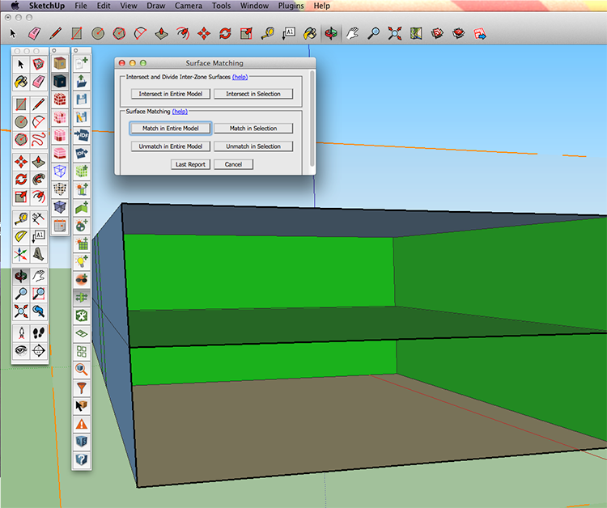  
  
  *Above: Surface Matching dialog shown.*
  
------
__Air Walls__

------

__Interior Partition Groups__

------

__Site Shading__

* To create a shading group use the "New Shading Group" (). The new group looks like a transparent purple box. Double click on box to enter the group and draw the shading surface.
 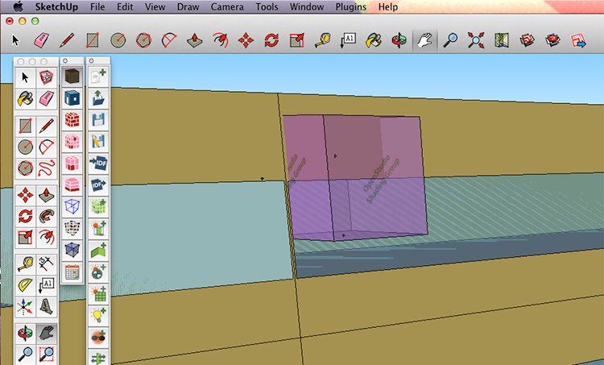

*Above: Surface Matching dialog shown.*

* Add overhangs by:

  * Drawing the shading surface using the SketchUp drawing tools or use a script to add.
    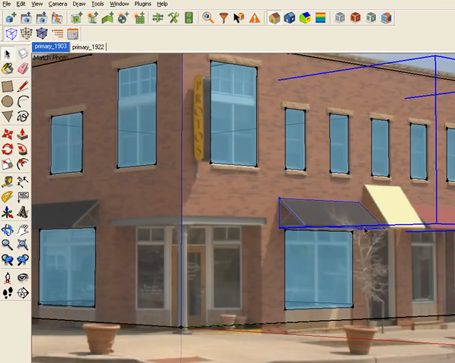
    *Above: Shading can be drawn on using photo matching.*
    
  * Using a script to automatically add overhangs.
    <iframe width="640" height="360" src="http://www.youtube.com/embed/wzzY_W2WELo?rel=0&start=295&end=360&autoplay=0" frameborder="0" allowfullscreen></iframe>
 
  *Above: This video shows you how search for specific surfaces and use a script to add overhangs to those surfaces.*
 
 ------

__Building Rotation__

------
## Schedules
__Year Settings__
The Year Settings subtab lets you set the day of the week the 
simulation should start. Define using Calendar Year or First Day Of Year buttons and pull-downs.

The tab can also be used to configure and turn Daylight Savings Time on and off.

__Inspecting and Adjusting Schedule Sets__
A Schedule Set is a collection of schedules for building activities or elements.

A schedule set can be applied to an entire building, a story, a space type, or an individual space.

This subtab has two kinds of drop zones. You can drop schedule sets from My Model or Library into the bottom of the left pane, or you can drop individual schedules into the drop zones in the main body.

__Inspecting and Editing Ruleset Schedules__
This tab is a visual editor for Ruleset Schedules. As the name implies, a schedule consists of a series of rules. Each rule or profile can be applied for a specific date range and for specific days of the week.

If two rules appear on the same day, the one with a higher priority is used. You can use the rule colors to visually scan the entire year in the calendar on the right of the body to see what rule is applied for a specific day.

A new profile starts as a flat line. Double click to split the profile and then drag one segment up or down. Vertical sections can also be dragged left or right. Click Set Limits to change the vertical limits of your profile. To type precise values for a profile, mouse over the profile and enter a value with your keyboard.

Although you can use 
Compact and other schedule types in your model, you can visualize and edit only Ruleset Schedules in the OpenStudio application.

The lower profile view is a navigation for when you are zoomed to 15-minute or 1-minute time steps.

 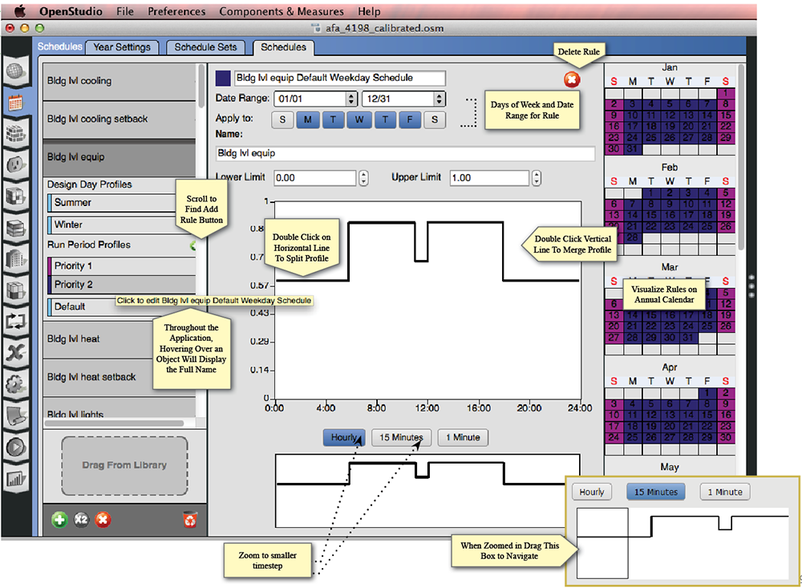
 
 *Above: An annotated screenshot of the schedules editing interface.*
  
   <iframe width="640" height="360" src="http://www.youtube.com/embed/PCcxruCaZO0?start=210&end=788&autoplay=0" frameborder="0" allowfullscreen></iframe>
  
  *Above: This video demonstrates how you can inspect, alter, and apply resource objects in the OpenStudio Application.*
  
* Assigning Schedules and Schedule Sets
* Other Types of Schedules
  * Constant
  * Compact
  
## Constructions
__Construction Sets__
A Construction Set object is structured very much like the Schedule Set. It can contain constructions for different surface types and boundary conditions.

A construction set can be applied to an entire building, a story, a space type, or an individual space.

Construction sets do not have to be complete sets. For example, you can have a construction set assigned to a story that has only an exterior wall. For the rest of the surface types, constructions will be inherited from the building object.

   <iframe width="640" height="360" src="http://www.youtube.com/embed/8KdVvBds_30" frameborder="0" allowfullscreen></iframe>
   
  *Above: This video shows you how to obtain construction and material objects from the Building Component Library and load them into your current model.*

__Constructions__

The Constructions subtab lists construction objects that are in your model. You can drag additional constructions here from the library. Constructions download using the Online BCL window will appear in the library with a “BCL” flag.

A construction consists of one or more material layers. You can add materials by dragging them from My Model or the Library to the drop zone. You can only add new materials to the bottom which represents the inside of the wall. You can delete any material by clicking the “x” next to the name.

__Materials__

Constructions are made of one or more layers of materials. The 
Materials subtab lets you inspect and edit those materials. 

There are various classes of material objects. When you add a new material, first select the heading for the type of material you want to add and then click the “+” icon at the bottom of the left pane.

Different types of material will have different data fields available.
  
<!--Tutorials
* Inspecting and Adjusting Construction Sets
* Adding and Removing Materials from a Construction
Resources
* Types of Constructions
* Types of Materials
* Proper Use of Constructions-->

## Internal Loads
The Loads tab contains internal load objects. The fields in the body will change appropriately when you pick a different type of load.

You can assign loads to a space type or directly to a space, except for Water Use Equipment.

The types of loads that can be added in this tab follow:

* People
* Lights
* Luminaires
* Electric Equipment
* Gas Equipment
* Steam Equipment
* Other Equipment
* Internal Mass
* Water Use Equipment

Internal mass is different than the other loads in that it does not use fuel; rather, it stores heat and then dissipates the heat over time. The inputs require a surface area 
assigned to a construction object.

Water Use Equipment is also unique in that it takes schedules, and is not part of a space type. Water Use Equipment is applied in the HVAC Systems Tab.

  <iframe width="640" height="360" src="http://www.youtube.com/embed/PCcxruCaZO0?start=106&end=209&autoplay=0" frameborder="0" allowfullscreen></iframe>
  
  *Above: This video demonstrates how you can inspect, alter, and apply resource objects in the OpenStudio Application.*
<!--#### Tutorials
  * Adjusting Internal Loads
  * Increasing Fidelity of Internal Loads-->
<!--#### Resources
  * People
  * Lights
  * Luminaires
  * Electric Equipment
  * Gas Equipment
  * Steam Equipment
  * Other Equipment
  * Internal Mass
  * Water Use Equipment-->

## Space Types
Space types are the work horses of the resources in OpenStudio. Space types can define internal loads, schedule sets, and construction sets.

Space types define specific spaces or groups of specific spaces in your model. The spaces inherit all objects of the space type. If you redefine a space type, or an underlying object, it will affect all spaces using that space type.

The space types tab in the OpenStudio application is organized into a grid view. You can look through all your space types and edit the settings.

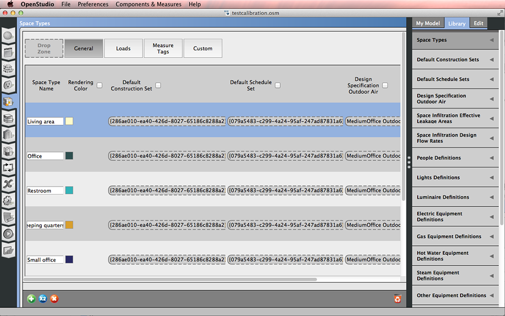

*Above: The grid view provides a spreadsheet style layout.*

If you select the "Loads" button in the Space Type tab, you will see a drop zone to create new loads. You can have multiple loads of the same type. 

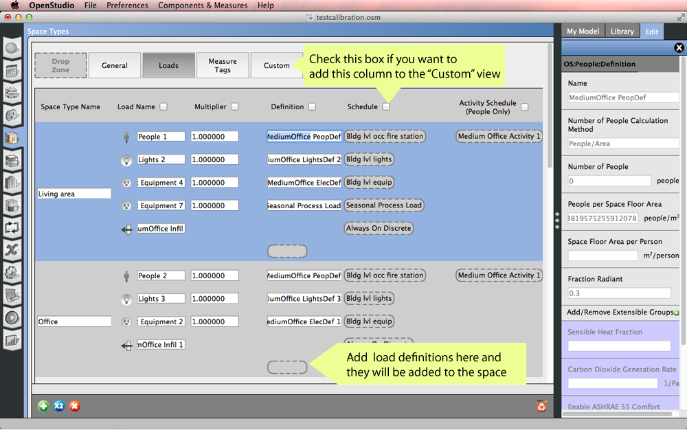

*Above: Hit the "Loads" button to edit and view loads by space type. Click on the name of a component and select the  "Edit" panel on the right to inspect and edit that item. You can edit the load definition in the example shown above.*

The space types define loads such as lighting or electric equipment as simple area weighted power densities (e.g., W/ft2).  However, you can add loads in several possible ways.  For example, a space type could contain multiple types of lighting. You might define one lighting load for general lighting using a W/ft2 and then add another lighting load for decorative lighting using another watts per square foot. 
 
#### Tutorials
The video below shows how to work with space types in the Plug-in. 
  <iframe width="640" height="360" src="http://www.youtube.com/embed/8LTexVna_vw?rel=0&start=0&end=234&autoplay=0" frameborder="0" allowfullscreen></iframe>
  
  *Above: This video shows you how to assign space types and download space types from the Building Component Library (BCL). It uses the OpenStudio SketchUp Plug-in.*  
<!--* Inspecting and Adjusting Space Types
* Assigning Space Types and Default Space Types-->   

#### Resources

* Measure Tags
  
    <iframe width="640" height="360" src="http://www.youtube.com/embed/uxpIcEbxPbw?rel=0&start=&end=&autoplay=0" frameborder="0" allowfullscreen></iframe>
    
      *Above: This video shows how to use measure tags.*
  
* Rendering Color
    This feature can be adjusted in the SketchUp Plug-in as well and the color selected will be used in the other application as well.
  
 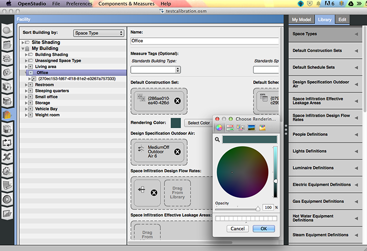
   <!-- * Default Construction and Schedule Sets
  * Design Specification Outdoor Air
  * Space Infiltration Design Flow Rates
  * Space Infiltration Effective Leakage Areas
  * Internal Load Instances-->
  
## Downloading Components and Measures from the Building Component Library (BCL)
In the OpenStudio Application you can download items directly from the BCL by going to the "Components & Measures" menu and choosing "Find Measures" or "Find Components." The your API key is available by registering on the [BCL site](https://bcl.nrel.gov/) and copying it from your account page.

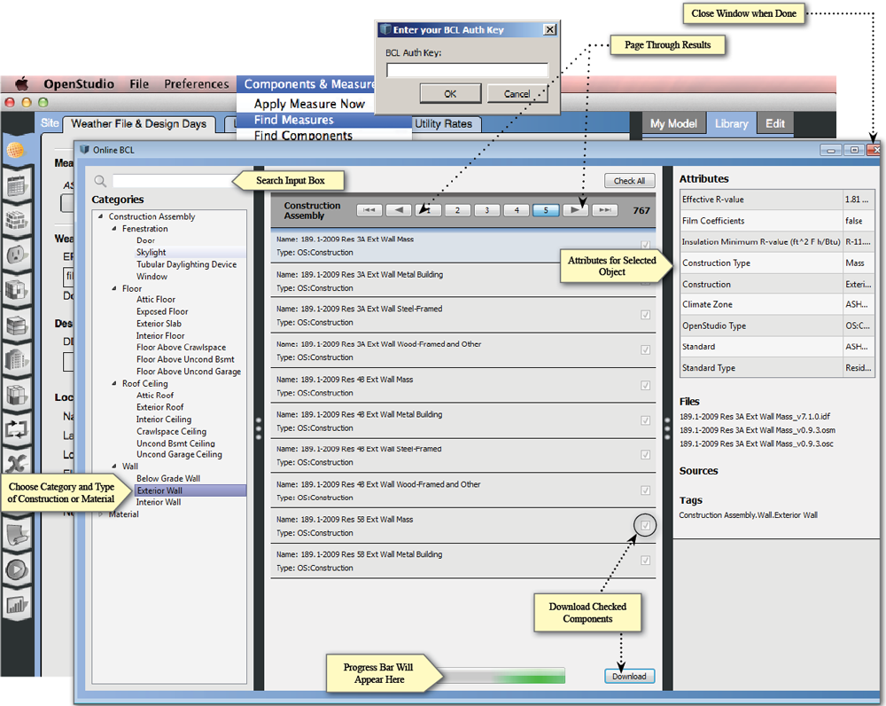

The components are designed to provide data to the energy modeler and simplify the process of gathering inputs. 

Measures are scripts that can quickly alter your model or create different reports for viewing and checking your results. Learn more about measures in the ["About Measures"](../measures/AboutMeasures.md) section. Learn how to [write your own custom measures.](../measures/Measure-Writing-Guide.md)

## Using the Facility Tab to Inspect and Edit Your Model
The Facility tab serves a number of functions. First, it allows you to see a hierarchical tree of your model. This tree can be 
organized by building story, thermal zone, or as shown here, space type.

If you are viewing the tree by space type, and a space does not have a space type assigned, it would appear under Unassigned Space Type. A similar pattern is followed for Thermal Zone and Story.

The Facility tab is also where you can select spaces and assign a building story, thermal zone, and space type. This is also where you can add loads to a space. These loads would be on top of loads inherited from the space type.

You can also drill down to inspect individual surfaces or subsurfaces.

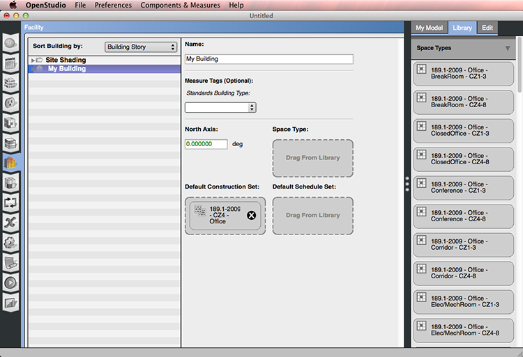
 
 *Above: An annotated screenshot of the facilities tab with the building selected.*
 
You can view the Building object. This contains top level construction, schedule, or space type assignments, and sets the rotation for the building. 

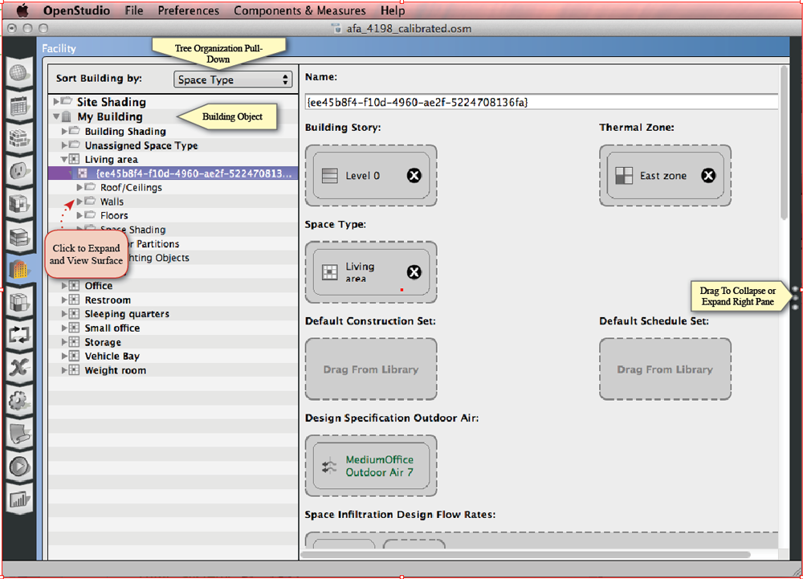
 
 *Above: An annotated screenshot of the facilities tab with space sort on.*

This screenshot of the Facility tab below shows a surface selected. 

Although you will generally work with the SketchUp Plug-in to define the building envelope, having a surface or subsurface selected in the Facility tab will allow you inspect and edit most attributes. Only the vertices are locked down.

Spaces and surfaces cannot be deleted or created. You need to use the SketchUp Plug-in to do that. 

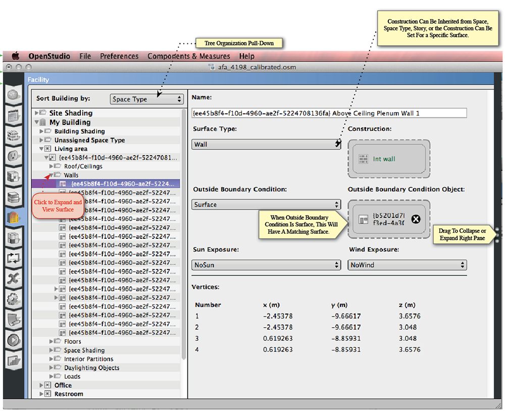
 
 *Above: Selecting and editing a sub-surface.*

## Thermal Zones
Setting up thermal zones in the SketchUp Plug-in is shown below.

<iframe width="640" height="360" src="http://www.youtube.com/embed/8LTexVna_vw?rel=0&start=240&end=438&autoplay=0" frameborder="0" allowfullscreen></iframe>
  
  *Above: This video shows you how to assign space types and download space types from the Building Component Library (BCL). It uses the OpenStudio SketchUp Plug-in.*

HVAC systems, thermostat, and humidistat settings can be viewed and edited on this tab. Select the "Cooling Sizing Parameters" or "Heating Sizing Parameters" to edit those by thermal zone.

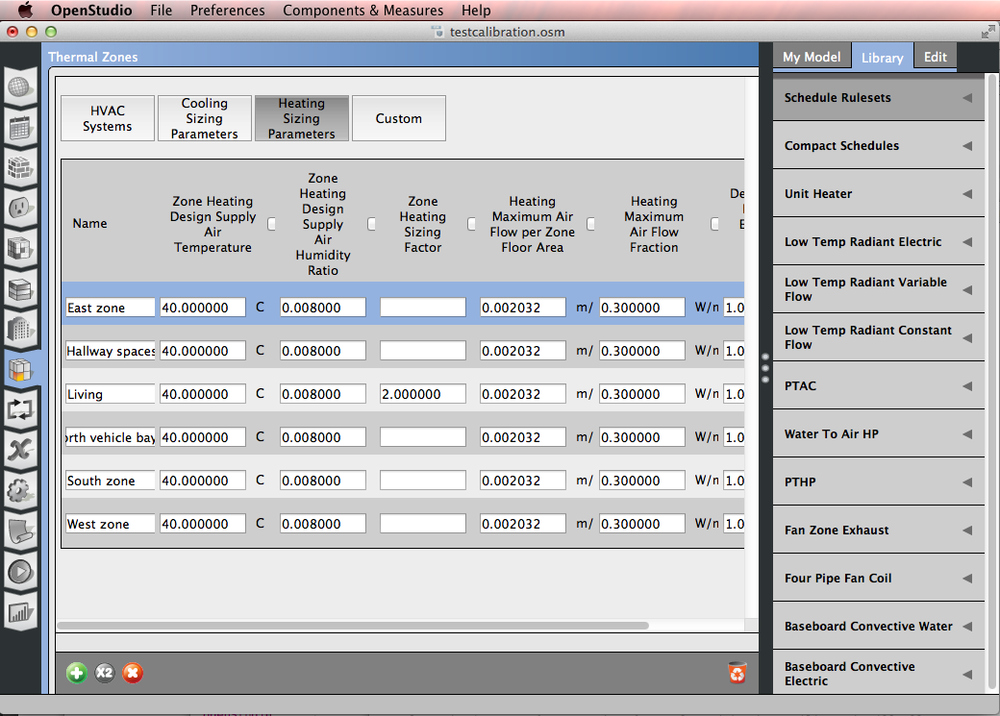

## Air, Plant and Zone HVAC Systems
The HVAC Systems tab is used to create, inspect, and edit air and plant loops. The green “+” at the top left is used to add template or empty loops, and the “x” next to it will delete them. The pull-down at the top right of the body is to select which loop to is displayed.

Hit the green plus button to add a loop. 

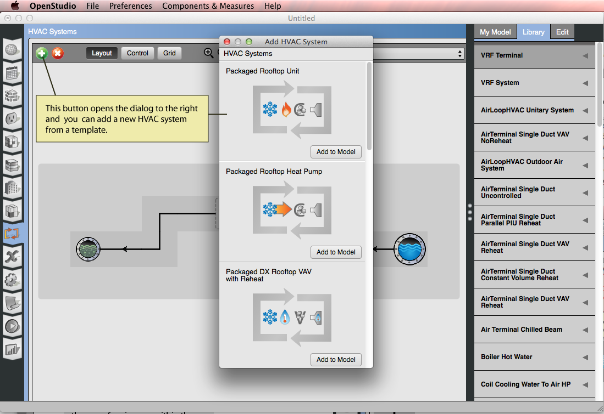
 
 *Above: Add an HVAC system to your model.*
 
When adding a template loop, there are four images within the icon. From left to right they represent the type of cooling, heating, fan, and terminal unit, in the template. The example below has cold and hot water, a variable speed fan, and a hot water reheat terminal unit.

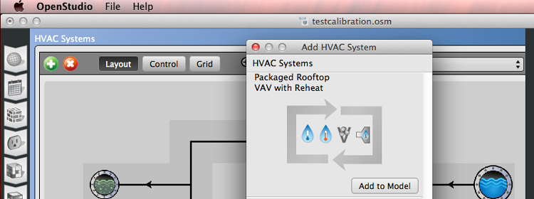

The top half of the loop is for supply-side objects, the bottom half is for demand. Thermal Zones and other objects can be dragged onto drop zones or nodes. Optionally you can select the splitter or mixer to bring up a list of Thermal Zones, checking the ones you want included in the loop.

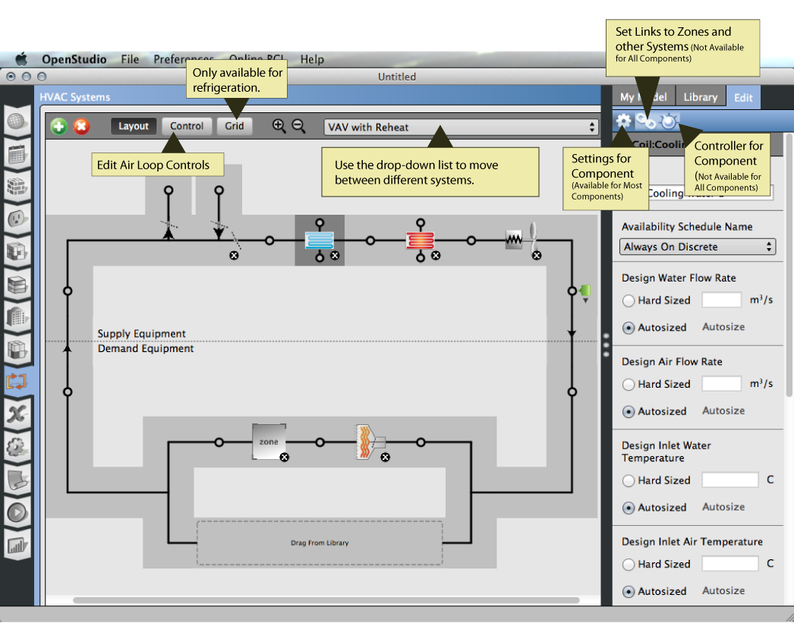
 
 *Above: Annotated view of the HVAC interface.*
 
  
The __controls view__ is only available for the air loops. With an air loop selected in “Layout” view you can switched to “Control” view.

In this view you can edit the time of operation, night cycle, supply air temperature, and mechanical ventilation.

  
  
  *Above: Control view only available for air loops.* 
  
### Cold Water Loop  
In the cold water loop the cooling coil that had been a supply side object on the air loop is now a demand object.

The supply side has a pump and a water cooled chiller. The adiabatic pipes are a necessary part of the loop. There are no attributes to set for the pipes.

You can click on the chiller to drill down further to the condenser loop. Or you can click on the cooling coil to go back to the air loop.
  
  <a href="../../img/create_model/chilled_water.png" target="_blank">
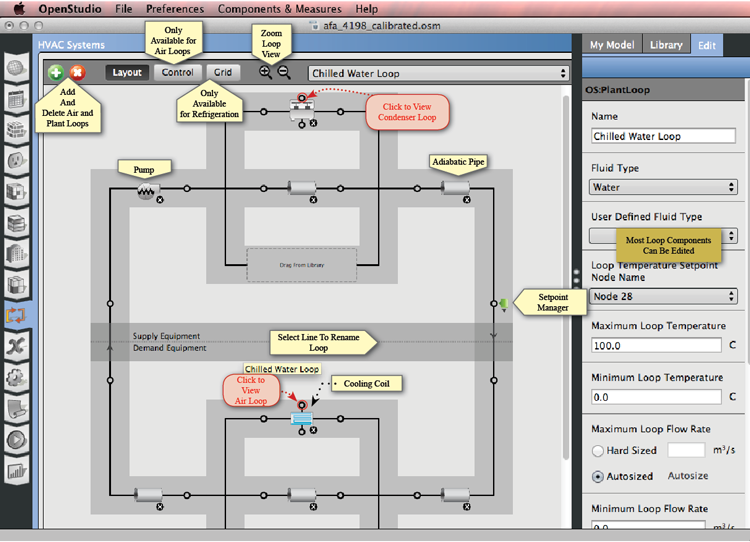</a>

*Above: Click image to view a larger version.*

### Condenser Loop
In the condenser loop the chiller that had been a supply side object on the cold water loop is now a demand object.

The supply side has a pump and a cooling tower. As with the cold water loop the adiabatic pipes are a necessary part of the loop. 

You can click on the chiller to drill to go back to the cold water loop.

  <a href="../../img/create_model/condensor_water.png" target="_blank">
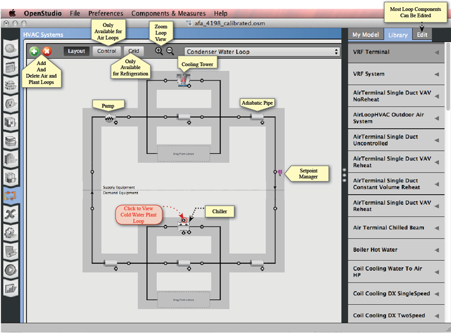</a>

*Above: Click image to view a larger version.*

### Hot Water Loop
In the hot water loop the heating coil that had been a supply side object on the air loop is now a demand object.

The supply side has a pump and a boiler. The boiler can use a variety of fuels. The adiabatic pipes are a necessary part of the loop. There are no attributes to set for the pipes.

You can click on the heating coil to go back to the air loop.

The heating coils without links represent the reheat terminals for each connected thermal zone.

  <a href="../../img/create_model/hot_water.png" target="_blank">
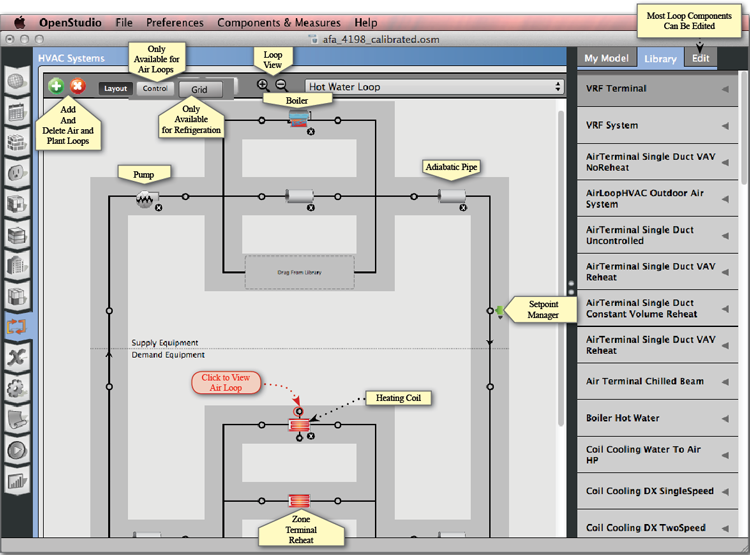</a>

*Above: Click image to view a larger version.*
  
## Return and Supply Plenums
To add supply and return plenum zones:

1. To access the plenum editor, select the zone on the layout view. 
2. Select the Edit tab on the right panel and click on the  plenum icon on the blue bar.
3. Choose a plenum from the drop down list or create a new plenum zone but selecting the green add button. The zones available to be plenums will be selectable in a dialog. Create new zones for plenums in the Thermal Zones tab on the left.

Shared plenums will be colored the same and will match the color selected for the plenum zone on the Thermal Zones tab.

  <a href="../../img/create_model/plenum_noted.png" target="_blank">
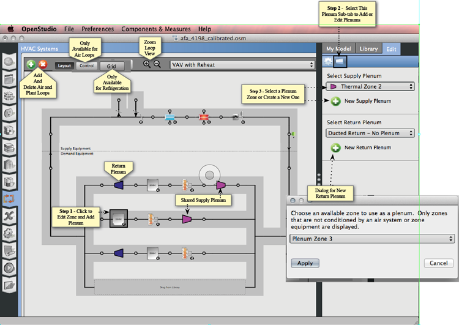</a>

*Above: Click image to view a larger version.*
  
  <iframe width="640" height="360" src="http://www.youtube.com/embed/n_u3WT2tX1Y?rel=0&start=&end=&autoplay=0" frameborder="0" allowfullscreen></iframe>
  
  *Above: This video demonstrates how to create the geometry for and then hook up supply and return air plenums.*
  
## Radiant Systems
## Service Water Heating
The first view into the HVAC tab will be the water mains editor, which shows as “Service Water” on loops pulldown list.

Water enters the system at the right and leave at the Sewer on the left. One or more water use connections can be added in the middle. 

  <a href="../../img/create_model/water1_large.png" target="_blank">
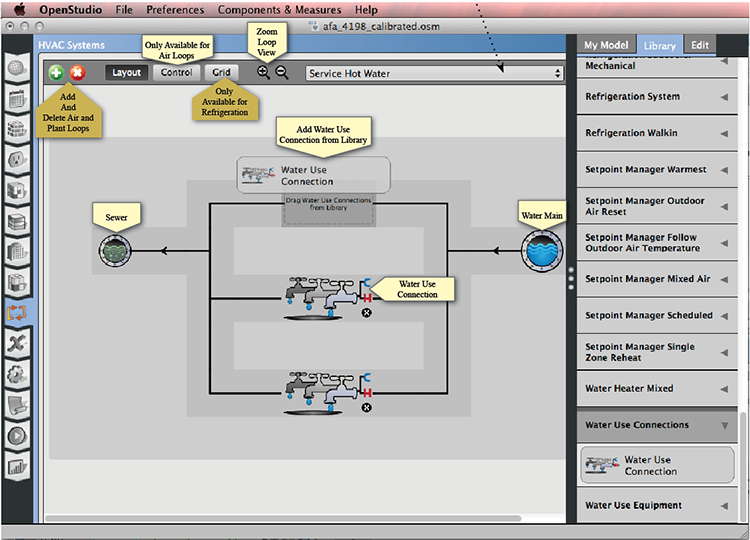</a>

*Above: Service hot water interface. Click the image to view larger version.*

Clicking a water use connection will take you to a model window where you can add water use equipment.

  <a href="../../img/create_model/water2_large.png" target="_blank">
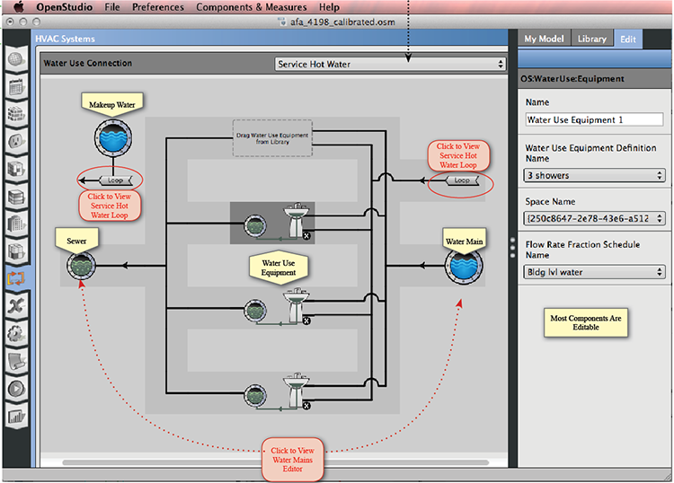</a>

*Above: Service hot water interface.Click the image to view larger version.*

Dragging a water use equipment object into the water use connection will create an instance of that definition. Much like lights, people and other loads, there is a fractional schedule to define usage patterns. 

Optionally you can associate the equipment with a space. There is no direct energy use to the space, but heat from the equipment will be added to the space.

The equipment can be anything that uses water, hot or cold. The definition contains a peak flow rate and a target temperature schedule. Hot and cold water will mix to reach the target temperature at the fixture.

Click the water main, sewer, or makeup water to go back to the water mains editor. If you have a plant loop associated with the water use connection the “Loop” button will take you to the loop.

 
<iframe width="640" height="360" src="http://www.youtube.com/embed/jUJhi6YH51E?rel=0&start=0&end=486&autoplay=0" frameborder="0" allowfullscreen></iframe>
  
  *Above: This video shows you how create models using service hot water. This includes water heaters, water use connections, water use equipment, and other associated objects.*
  
  
## Refrigeration
The refrigeration system interface can be accessed by selecting refrigeration from the drop down menu.

To add a refrigeration system select one from the library and add drag it to the drop zone.

Click on the zoom button by the name of the refrigeration system to go to a view of that system, add components from the library.

 <a href="../../img/create_model/refrig_1_large.png" target="_blank">
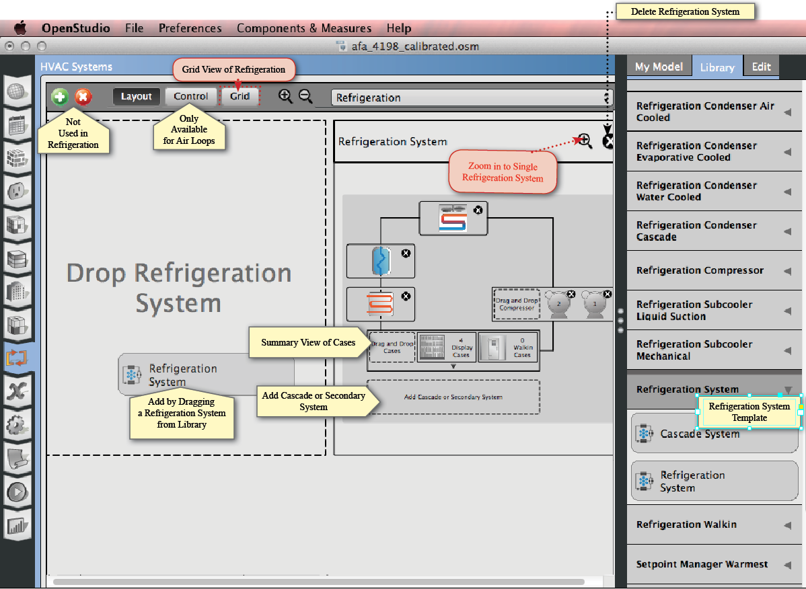</a>

*Above: Adding refigeration systems to your model under the HVAC tab. Click image to view a larger version.*

This zoomed in view provides the layout view of one refrigeration rack. You may add cases by dragging them on to the “Drag and Drop Cases” drop zone.

Drop zones are provided to accommodate systems with a mechanical subcooler and an Suction Line Heat Exchanger (SLHX).

The small arrow at the bottom of the refrigeration case summary will open and expanded view of cases. Each case can be selected and edited in the Edit panel on the right.

Cascade systems can be added by dragging the from “My Model” or the “Library.”

 <a href="../../img/create_model/refrig_2_large.png" target="_blank">
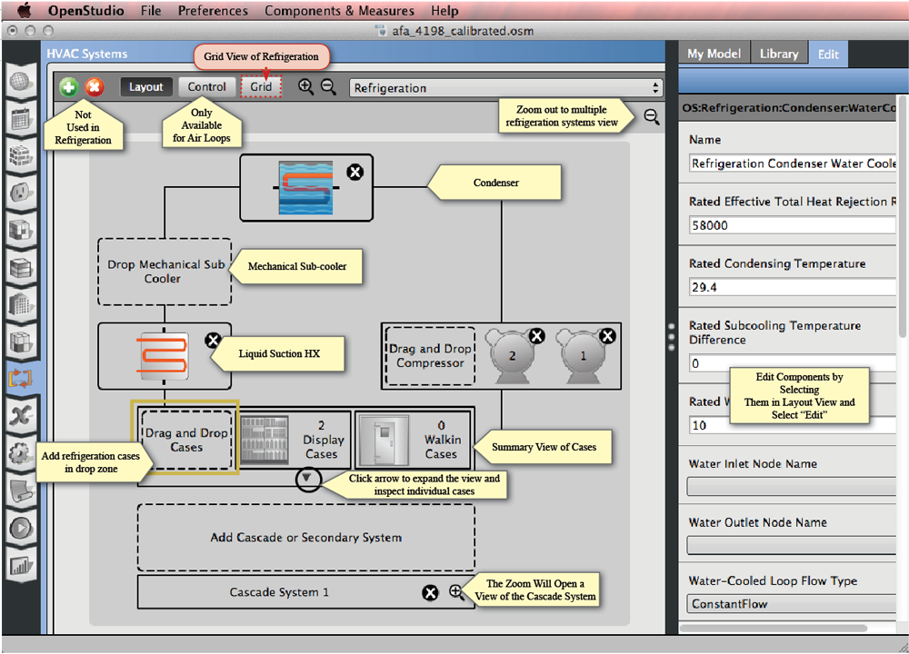</a>

*Above: Single refrigeration system view. Click image to view a larger version.*

An alternate view of the refrigeration systems is provided by the grid view. The refrigeration grid view provides a method for entering case settings in a spreadsheet style. Cases can be added, assigned to racks, and edited in this view.

There are two major divisions, one for Display Cases and another for Walk-ins. Under each division a drop box is available to add new cases. There are also buttons to move through the case settings and enter the data on each case. 

Create your own custom view of this information by checking the box on the right of the column header. Checked columns will show up under the Custom button.

  <a href="../../img/create_model/refrig_grid_large.png" target="_blank">
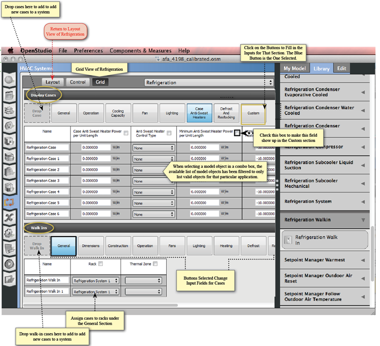</a>

*Above: Click image to view a larger version.*

<iframe width="640" height="360" src="http://www.youtube.com/embed/iHTDiHif2_U?rel=0&start=&end=&autoplay=0" frameborder="0" allowfullscreen></iframe>

*Above: This video demonstrates the new refrigeration features added to OpenStudio 1.2.0. These feature will be expanded in future releases.*

<iframe width="640" height="360" src="http://www.youtube.com/embed/NRo9k0Rjfw8?rel=0&start=57&end=166&autoplay=0" frameborder="0" allowfullscreen></iframe>

*Above: The video above provides an introduction to the grid view provide for refrigeration.*

In the initial release of the grid view, no provision was made to delete a case or walk in; they must be must be assigned to a rack, and deleted from the layout view.  This functionality omission will be corrected in the next OpenStudio release.

## VRF Systems
Variable refrigerant flow (VRF) systems can be added by dragging them onto the large drop zone from the library.

The layout view provides a view of all the VRF systems in the model. The zoom icon by the name of the system will open a detailed view of that system. 

  <a href="../../img/create_model/vrf_layout_large.png" target="_blank">
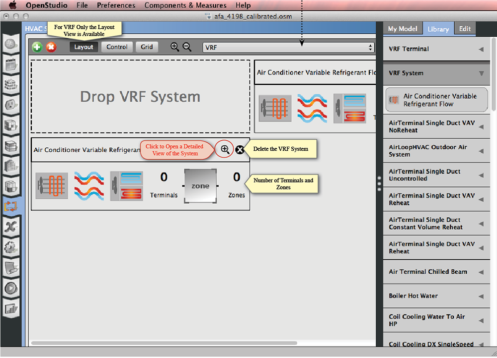</a>

*Above: VRF system layout view. Click image to view a larger version.*

To create your VRF system, start by dropping a terminal from the “Library” onto the drop zone. Then add thermal zones from “My Model.” When a thermal zone is added a new VRF terminal will automatically be created.

   

*Above: VRF system single system layout view. Click image to view a larger version.*

Set the terminal settings by selecting the terminal and editing in the “Edit” tab on the right.

More than one terminal can connect with the same zone. Just drag the zone to the drop area again to add another connection.

<iframe width="640" height="360" src="http://www.youtube.com/embed/NRo9k0Rjfw8?rel=0&start=170&end=242&autoplay=0" frameborder="0" allowfullscreen></iframe>

*Above: This video provides a brief overview of the VRF interface.*

## Apply Measures Now
Now in addition to manually creating and editing your model, you can apply measures to your model live in the application. This allows you to customize your experience to your desired workflow. Measures can manipulate any part of the model and can also be used as a diagnostic tool.

 

*Above: Select the apply measures now from the the menu.*

 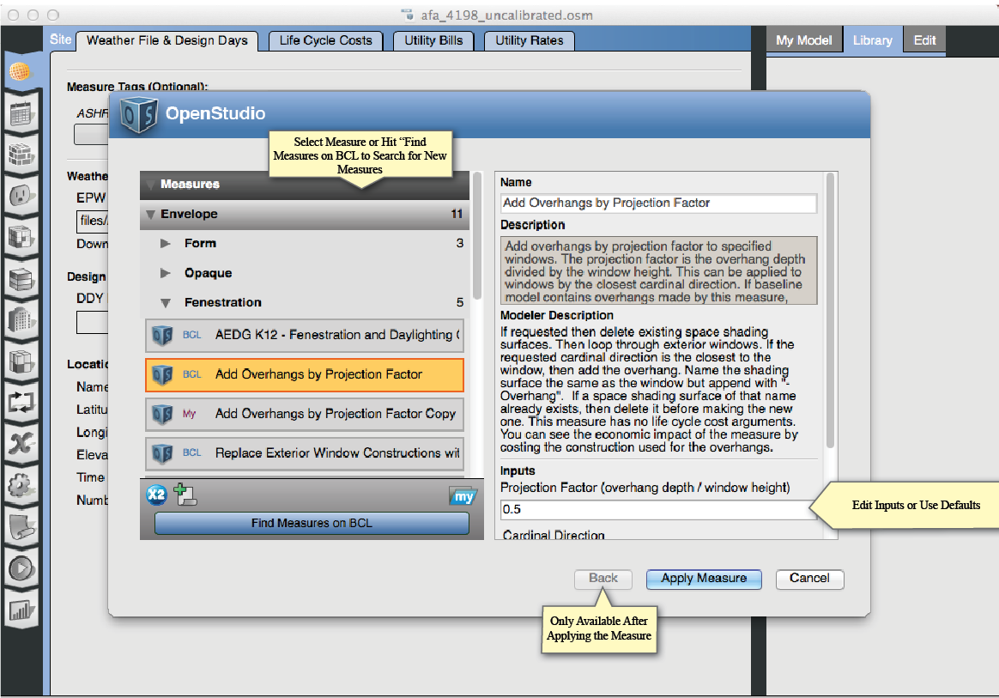

*Above: Select measure.*

 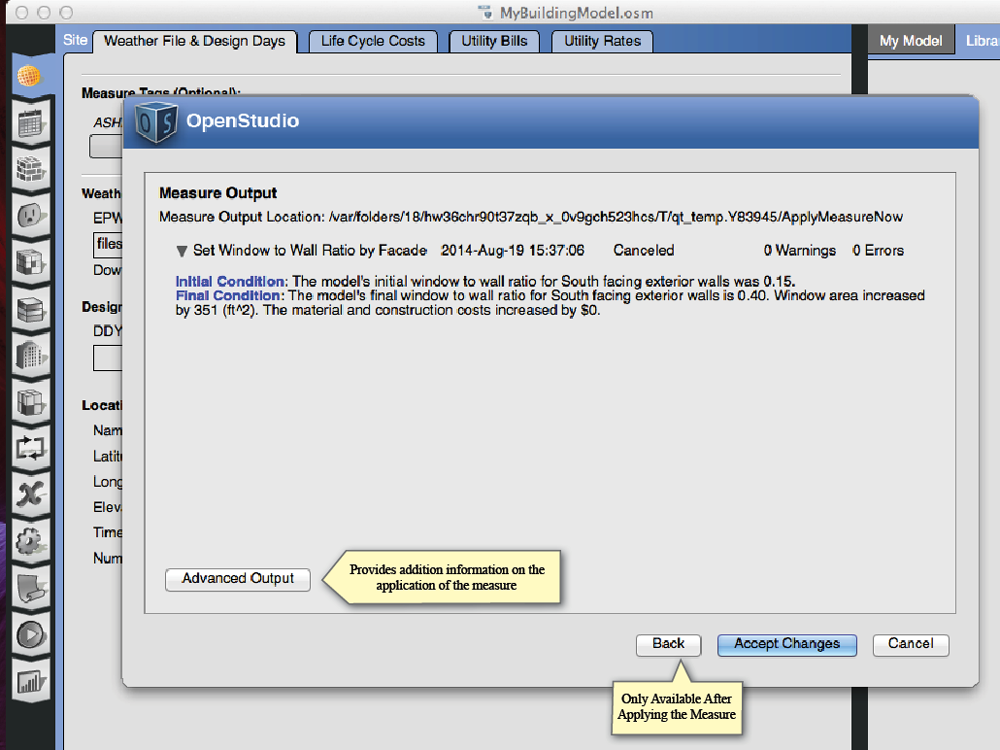

*Above: Select measure.*

The video below demonstrates the use of this feature.

<iframe width="640" height="360" src="http://www.youtube.com/embed/9-saA4x07eQ?rel=0&start=0&end=579&autoplay=0" frameborder="0" allowfullscreen></iframe>
  
  *Above: Use the Apply Measures Now function.*
  
##  Using the Measures Tab
The measures selected on this tab will not run until you run your model, unlike the "Apply Measures Now" option. 

Download additional measures from [The Building Component Library (BCL)](http://bcl.nrel.gov/). Drag measures from the library to the central panel.

There are three types of measures: 

1. __OpenStudio Measures__ are run on the OSM model before it is converted to an IDF. 
2. __EnergyPlus Measures__ can be run on the IDF file before it is handed to EnergyPlus.
3. __Reporting Measures__ produce reports to chart results, provide quality assurance, and quality control on models.

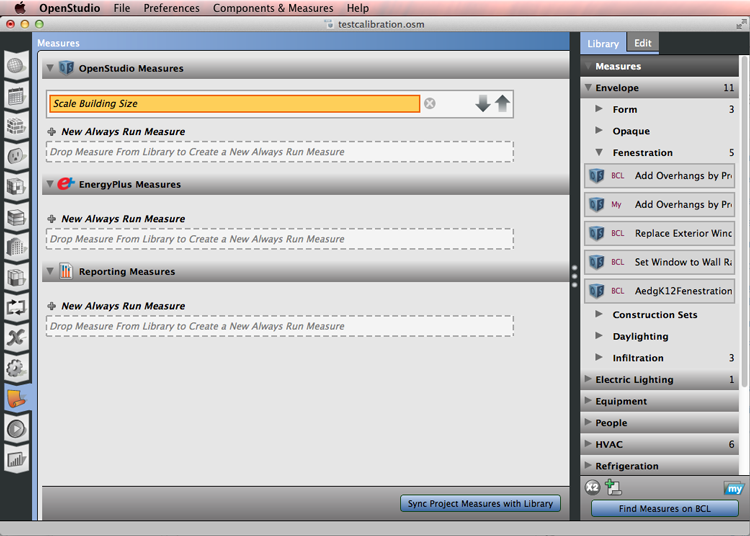

*Above: Select measures from the library and drag them into the correct drop zone.*

By selecting the measure and selecting the right “Edit” tab, inputs for the measure can be entered and adjusted.

*Above: Select a measure and edit the fields in the right panel.*
  
## Lifecycle Costs
The most basic parameters needed for a life cycle cost analysis are the analysis period length and the discount rate. A longer analysis period accumulates more energy cost savings than a shorter period; giving energy conservation measures a better pay back relative to their initial costs. A higher discount rate devalues future energy cost savings relative to money spent on capital improvements in the present; giving energy conservation measures a lower pay back relative to their initial costs. This tab allows users to set these parameters on their baseline model.

With measures, downloaded from BCL,  life cycle costs for different design alternatives can be calculated

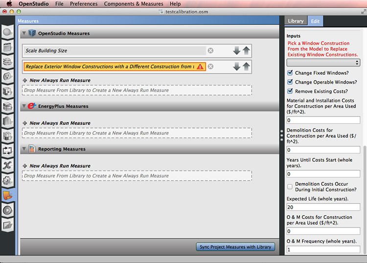

*Above: Add costs to measures to calculate and compare different options. This can also be done in the ParametricAnalysisTool.*

## Calibration with Utility Bills
Add utility bills for calibration on the Utility Bills Tab under Site.

First, you must __select a weather file__ and __go to the schedules tab under year and select the year__ before you can enter the bills. 

1. Select the type of utility on the left.

2. Hit the plus button to add bills.

3. Name the Bill and complete the units fields.

4. Select the billing period inputs and hit the plus sign to add a bill.

To calibrate to the ASHRAE 14-2002 or FEMP standard the file must contain all utility data for one year and real weather data. Check the guidelines for additional 
requirements. 

 
 
 *Above: An annotated screenshot of the schedules editing interface.*

<!--May move this to a page Using Radiance-->   

