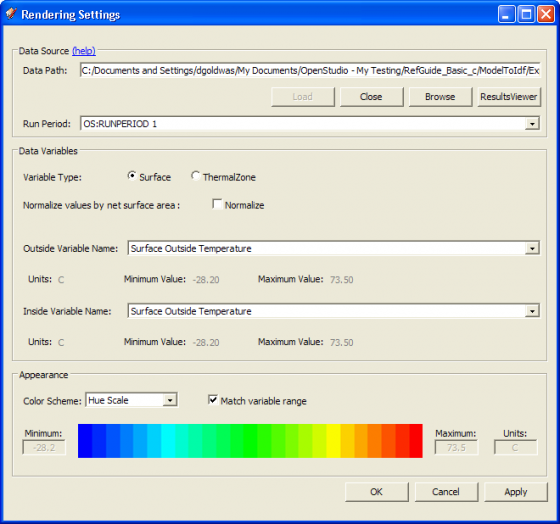

## The SketchUp Plug-in Interface 
This section provide the legend for toolbars and menus available tin the Plug-in. You may also find helpful information in the [OpenStudio Quick Start Guide (PDF)](../img/pdfs/openstudio_interface_quickstart.pdf).

### File Management
Tools in this set create, open, save, import, or export data to or from your model. Some have toolbar icons; some do not. These functions are also located the OpenStudio Plug-in menu.
<table class="tablesorter table table-striped">
<thead>
<tr>
<th>Icons</th>
<th align="left">Functionality</th>
</tr>
</thead>
<tbody>
<tr>
<td> </td>
<td align="left">
#### The New OpenStudio Model From Template 

This tool closes your current OpenStudio model and creates a new one. It does not close your current SketchUp file, but loads a new OpenStudio model into it.</td>
</tr>
<tr>
<td></td>
<td align="left">
#### The Open OpenStudio Model

Use this feature to close your current OpenStudio model and open an OpenStudio File (.OSM). It does not close your current SketchUp file, but loads a different OpenStudio model into it. OpenStudio 0.6.0 introduced an udpated OSM format. It will not open OSM files created with OpenStudio 0.4.4 or earlier, and may not open some files made created with OpenStudio 0.5.0.</td>
</tr>
<tr>
<td></td>
<td align="left">
#### Save OpenStudio Model

Saves your OpenStudio Model as an OpenStudio File (OSM). If you save your OSM file and then save your SketchUp model, the SketchUp model will maintain a link to the OSM model. If you close and reopen your linked SketchUp file (SKP) it will reload the content from the OSM file. All the energy model content is saved in the OSM file, not in the SketchUp file. 
  
The benefit of having a link to a SketchUp file is to maintain a relationship with non-OpenStudio content that you may have in your model, such as a base plan or base model. A linked SketchUp file also has save scenes, drawing styles, and section cut location. When saving your OpenStudio model, make sure your file name ends with the ".osm" extension. If it does not have that extension, OpenStudio will not open the file. If you have files without this extension, you can manually rename them; they should open.</td>
</tr> 
<tr>
<td></td>
<td align="left">
#### Save As OpenStudio Model 

Using this feature saves your OpenStudio Model as a new OSM file and updates the SketchUp file to link to the newly saved OSM file.

When saving your OpenStudio model, make sure your file name ends with the ".osm" extension. If it does not have this extension, OpenStudio will not open the file. If you have files without this extension, you can manually rename them; they should open.

</td>
</tr> 
<tr>
<td></td>
<td align="left">
#### Import EnergyPlus Input Data File (IDF) 

This feature function similarly to the Import OpenStudio Model tool. If you import an entire IDF model, your current OSM model is closed and a new one created from your IDF. When you import and then save an IDF model, you will be prompted to save it as an OSM file. If you want to keep it as an IDF model, you can choose the Export EnergyPlus Input Data File tool instead of the Save OSM tool. If you have added geometry or other objects, such as interior partitions that are unique to an OpenStudio Model, you will lose or alter those objects when you export back to an IDF file.

Like the Import OpenStudio Model tool, the Import EnergyPlus Input Data File tool can be used to import additional content into your model. In this import workflow your OSM model stays open and the import tool adds additional content from a previously saved IDF file. 

Content types that can be imported from an IDF file follow.

 - Constructions (including materials)

 - Schedules.

You can access these features under the Plugins/OpenStudio menu or the File/Import menu. "Space Loads" are unique to an OSM, so they cannot be imported from an IDF file.

*Above: Import dialog allows you to import OpenStudio models, constructions, schedules, and space loads. You can also import IDF file through this menu.*
</td>
</tr> 
<tr>
<td>
</td>
<td align="left">
#### Export EnergyPlus Input Data File 

Use this to when exporting an IDF file from an OSM model.  This can be useful if you need an IDF file to use in an application that does not support the new OSM format. Some model data may be lost when exporting to an IDF because the OSM file format supports many objects, such as interior partition groups and surfaces, that are not in EnergyPlus. If you export an OSM model with unsupported elements to an IDF file, and then reimport it into OpenStudio, the unsupported elements will be gone.

Good practice for a typical workflow is to always use your OSM file as the working file. You can simulations in EnergyPlus directly from an OSM file by using the OpenStudio RunManager application as a stand-alone application or through the OpenStudio SketchUp Plug-in interface.

When exporing an IDF file, make sure your file name ends with the ".idf" extension. If it does not have this extension, EnergyPlus and other applications may not open the file. If you have files without this extension, you can manually rename them; they should open.

</td>
</tr> 
<tr>
<td></td>
<td align="left">
#### Import OpenStudio Model 

This tool can function similarly to the Open OpenStudio Model tool. If you import an entire model, your current model is closed and a new one loaded. When you import an OSM model and then save the OSM model, you will be prompted for a new file name. This prevents you from accidentally overwriting your original file.
  
The Import OpenStudio Model tool can also be used to import additional content into your model. In this import workflow your OSM model stays open and the import tool adds content from a previously saved OSM file (see the Import dialog image above.) Content types that can be imported from an OSM file follow:

 - Constructions (including construction sets, constructions, and materials)

 - Schedules

 - Space loads

</td>
</tr>
<tr>
<td></td>
<td align="left"> 
#### Export OpenStudio Model 

This tool prompts you for a new file name for your saved file. As you continue to work, you alter your original file instead of the exported file.
</td>
<tr>
<td></td>
<td align="left"> 
#### Importing gbXML Files

There is no toolbar icon to use for importing gbXML (Green Building XML) files; this functionality is available through the "Plugins->OpenStudio->Import->Import gbXML Model" menu item only. If you import a gbXML model, your current OSM model is closed and a new one was created from your gbXML. When you import a gbXML model and then save the model, you will be prompted to save it as an OSM file. Currently, there is no export of gbXML from OpenStudio.

*Above: Import dialog allows you to import gbXML files.*

The following gbXML element types are imported from gbXML to the OpenStudio Model:

- Construction

- Material

- ScheduleDay

- ScheduleWeek

- Schedule

- Campus

- Building

- Space

- Surface

- SubSurface

*Above: Screenshot of Import gbXML Model result*

</td>
<tr>
<td></td>
<td align="left"> 
#### Export Untranslated EnergyPlus IDF 

When an IDF file is imported into the SketchUp Plug-in, a translation between EnergyPlus IDF and OpenStudio OSM occurs.  OpenStudio does not yet support translation of all objects from EnergyPlus IDFIDF to OpenStudio OSM. To support users with workflows that switch between IDF and Osm, the SketchUp Plug-in allows users to export IDF objects that were not translated during the import. These objects are written to a plain text Idf file so the user may then reintegrate these untranslated objects with the IDF produced by the OpenStudio OSM to EnergyPlus IDF translation.  After importing an EnergyPlus IDF, a prompt will alert the user if there are objects that could not be translated to OpenStudio Osm.

*Above: User Prompt on EnergyPlus Idf Import*

To save untranslated EnergyPlus Idf objects, select the menu item "Plugins->OpenStudio->Export->Export Untranslated EnergyPlus Idf".

*Above: Export menu available through Plugins menu*

</td>
</tbody>
</table>
### Modeling Tools
Tools in this set create new zones, groups, and geometry.
<table class="tablesorter table table-striped">
<thead>
<tr>
<th>Icons</th>
<th align="left">Functionality</th>
</tr>
</thead>
<tbody>
<tr> 
<td>
</td>
<td align="left">
#### New Space

You can use the New Space tool to create a new OpenStudio space. Activate the tool and then click where you want your zone origin to be. An OpenStudio space is a top-level object in your SketchUp workspace. If you want to draw in the space, you first need to enter into the space through one of the following methods:
<ul>
<li>Double-click on the space while it is selected (this may be difficult if other model objects get in the way).</l1i>
<li>While the space is selected, right-click and choose "edit group" from the contextual menu. (You can also go to the edit menu under "group" or "solid group.")
Select the object by name from SketchUp's outliner window and then double-click or right-click and choose "edit group."</li>
<li>You can set up a keyboard shortcut that will take you into the selected group. A tutorial will be added to the documentation that shows you how to add your own shortcuts or load some preconfigured OpenStudio shortcuts.</li>
</ul>
Once you are inside a space, you can draw surfaces. You can also add shading groups, interior partition groups, daylighting control points, luminance maps, and luminaire objects. An alternate method to make new spaces is to copy and paste a space.

*Above: Screenshot of OpenStudio Inspector with an OpenStudio space selected*

*Above: Screenshot of OpenStudio Inspector with an OpenStudio surface selected*

*Above: Screenshot of OpenStudio Inspector with an OpenStudio subsurface selected*

</td>
</tr>
<tr> 
<td>
</td>
<td align="left">
#### New Shading Surface Group

The New Shading Surface Group tool is used to create a new EnergyPlus shading group. Activate the tool and then click where you want your shading group origin to be. An EnergyPlus shading group can be a top-level object in your SketchUp workspace, or it can be placed within a space. If you want to draw in the group, you first need to enter into the group through one of the following methods:
<ul>
<li>Double-click on the group while it is selected (this may be difficult if other model objects are in the way).</l1i>
<li>While the group is selected, right-click and choose "edit group" from the contextual menu. (You can also go to the edit menu under "group" or "solid group").</li>
<li>Select the object by name from SketchUp's outliner window and then double-click or right-click and choose "edit group".</li>
<li>You can set up a keyboard shortcut that will take you into the selected group. A tutorial will be added to the documentation that shows you how to add your own shortcuts or load some preconfigured OpenStudio shortcuts.</li>
</ul>
You can create shading surface groups within or outside a space. Once you enter into a shading surface group, you can draw shading surfaces. An alternate method to make new shading groups is to copy and paste a group.

*Above: Screenshot of OpenStudio Inspector with an OpenStudio subsurface selected*

</td>
</tr>
<tr> 
<td>
</td>
<td align="left">
#### New Interior Partition Surface Group

The New Interior Partition Surface Group tool is used to create a new OpenStudio Interior Partition Group. Activate the tool and then click where you want your interior partition group origin to be. If you want to draw in the group, you first need to enter into the group through one of the following methods:
<ul>
<li>Double-click on the group while it is selected (this may be difficult if other model objects are in the way).</l1i>
<li>While the group is selected, right-click and choose "edit group" from the contextual menu. (You can also go to the edit menu under "group" or "solid group").</li>
<li>Select the object by name from SketchUp's outliner window and then double-click or right-click and choose "edit group".</li>
<li>You can set up a keyboard shortcut that will take you into the selected group. A tutorial will be added to the documentation that shows you how to add your own shortcuts or load some preconfigured OpenStudio shortcuts.</li>
</ul>
You can create interior partition groups within a space only. Once you enter into an interior partition group, you can draw interior partition surfaces. An alternate method to make new interior partition groups is to copy and paste a group. Interior partition surfaces are not used as heat transfer surfaces, but they still have an associated construction. This construction, along with the surface area, is used to create internal mass that is used to run simulations and create objects for IDF export. In the future, interior partition surfaces and their constructions will be used by other processes.

*Screenshot of OpenStudio Inspector With an Interior Partition Group Selected*

*Screenshot of OpenStudio Inspector With an Interior Partition Surface Selected*

</td>
</tr>
<tr> 
<td>
</td>
<td align="left">
#### New Daylighting Controls Object

The New Daylighting Controls Object tool creates a new OpenStudio Daylighting Controls object. This consists of a single sensor, which by default will be placed 30 inches above the surface you click on. You can move the object with the SketchUp move tool or through the Object Inspector, and you can set many attributes that feed information to EnergyPlus. The Glare Calculation Azimuth Angle of View Direction also changes the appearance of the object in OpenStudio. To report data from the sensors in EnergyPlus, you also need to include light objects in your model. Most space types in the template files already include a light object.

You can create a daylighting controls object from within a space, or you can copy and paste one into a different space.

*Above: Screenshot of Daylighting Control Objects Inside a Space*

*Above: Screenshot of Daylighting Control Objects Inside a Space*

To associate a daylighting control object with a thermal zone, select the desired thermal zone object and then choose a primary (and optionally a secondary) daylighting control object.

*Above: Screenshot of OpenStudio Inspector with a Thermal Zone selected*

</td>
</tr>
<tr> 
<td>
</td>
<td align="left">
#### New Illuminance Map

The New Illuminance Map tool creates a new EnergyPlus Illuminance Map object. This consists of rectangle with a grid representing map data points. By default it will be placed 30 inches above the surface you click on. You can move and resize the Illuminance Map with the SketchUp Move and Scale Tool and through the Object Inspector. To obtain data reported for the map in EnergyPlus, you also need to include a Daylighting Controls Object and lights. Most space types in the template files already include a light object.

You can create an illuminance map from  within a space, or you can copy and paste the map into a different space. You can have multiple illuminance maps in a space.

*Above: Screenshot of Illuminance Map Object Inside a Space.*

*Above: Screenshot of OpenStudio Inspector With an Illuminance Map Object Selected*

To associate an illuminance map with a thermal zone, select the desired thermal zone object and then choose an illuminance map object.

*Above: Screenshot of OpenStudio Inspector With a Thermal Zone Selected*

</td>
</tr>
<tr> 
<td>
</td>
<td align="left">
#### New Luminaire Tool

The New Luminaire tool creates a new OpenStudio Luminaire object. This object is used to represent a single lighting fixture; power used by this object is represented in EnergyPlus and this object will eventually be used in electric lighting simulation using Radiance. The object is represented by a rectangle with a red triangle on top. The shorter edge of the red triangle goes from the center of the rectangle to the edge in the positive x direction; the longer edge goes out in the positive y direction. 

*Above: Detail of Luminaire Object*

*Above: Luminaire placed within Space in model*

When a luminaire is placed it must refer to an OS:Luminaire:Definition object to define its power usage and photometric description. If no luminaire definition objects exist when the luminaire is placed, a new one will be created. If one or more luminaire definition objects exist, a dialog will prompt you to select a definition to use or to make a new one.
  

*Above: Luminaire Definition Prompt*

</td>
</tr>
<tr> 
<td>
</td>
<td align="left">
#### New Glare Sensor

The New Glare  Sensor Object tool is a new addition to OpenStudio 0.9.0. It creates a new OpenStudio Glare Sensor that supports Radiance simulations. Unlike the Illuminance Map and Daylighting Control Point, the Glare Sensor has no connection to a Thermal Zone. The default placement of the sensor is 30 inches above the surface you click on. You can move the object with the SketchUp move tool or through the Object Inspector, and you can set many attributes that feed information to Radiance. 
  
You can create a Glare Sensor object from within a space, or you can copy and paste one into a different space.
  

*Above: Screenshot of OpenStudio Inspector Glare Sensor selected*

</td>
</tr>
<tr> 
<td>
</td>
<td align="left">
#### Surface Matching

The Surface Matching tool is used to automatically set outside boundary conditions for space surfaces and assign the appropriate outside boundary object in adjacent spaces when "surface" is the outside boundary condition. The Surface Matching tool can match or unmatch surfaces in your selection or for the entire model.
  

*Above: Screenshot of Surface Matching Dialog Box*

</td>
</tr>
<tr> 
<td>
</td>
<td align="left">
#### Set Space Attributes

The Space Attributes Tool can be used to set attributes for one or more selected spaces in your OpenStudio model. The first four pull-down menus (Space Type, Building Story, Construction Set, and Thermal Zone) set attributes of the selected space objects. The last two pull-down menus work a little differently. They set attributes in the thermal zone associated with the selected spaces. Most of the menus allow you to choose from a list populated by the appropriate model objects or one of the following options: No Change, Clear Field, or Make a new Object. The exception is the ideal air loads, which has a <no change> option, or yes/no. The Thermostat menu is similar to the others, but does not offer the option to create a new thermostat. You can create a new thermostat from the inspector.
  

*Above: Screenshot of Space Attributes Dialog Box*

The following image shows the model after a new space type is applied to two selected spaces. The render mode is set to render by space type.
  

*Above: Screenshot of Space Attributes Dialog Box*

</td>
</tr>
<tr> 
<td>
</td>
<td align="left">
#### Create Spaces from Diagrams

The Space Diagram Tool allows you to use native SketchUp tools to draw a space diagram representing your building's floor plan. After drawing the diagram, you can select the surfaces and create a single-story or multistory building based on the diagram. Your model will have one space for each surface in your diagram for each floor. You can use this tool multiple times. If you want to create a new diagram with a unique floor  for higher floors, just repeat the steps you used for the original diagram.
  
Surfaces that are not horizontal will be ignored; surfaces with improper surface normals will be flipped over. Once made, the spaces are like any other OpenStudio space. You can enter the space and alter or extend your geometry to refine it beyond the basic geometry created by the space diagram tool.
  

*Above: Screenshot of Space Diagram Dialog Box*

The following image shows the resulting model after using the Space Diagram Tool. The loose geometry of the diagram will be saved onto a layer in SketchUp named "OpenStudio - Space Diagrams". Although the resulting spaces are saved in your OpenStudio model (OSM file) the diagram is not. If you want to keep the diagram, you can save the SketchUp file as well. Even if you do not save the SketchUp file you will still have access to the diagram until you quit. If you want to make a change to the diagram, you can delete the spaces, alter the diagram, and re-project them.

*Above: Screenshot of Model After Using Space Diagram Tool*

</td>
</tr>
<tr> 
<td>
</td>
<td align="left">
#### Project Loose Geometry

The Project Loose Geometry Tool allows you use the native SketchUp tools  to draw loose geometry onto surfaces of your building envelope. When you are ready to project these surfaces into the spaces of your model, you can open this tool and run it across all loose geometry or the selected loose geometry. Although this is often used to create fenestration, it can also be used to split a base surface into two base surfaces. For example, you can create a line 3 feet above the ground representing a change in construction from concrete block to brick. The advantage over this tool--versus the traditional method of entering and drawing within a space--is that you can quickly create surfaces across many spaces without having to ever enter those spaces.

If some of the surfaces you have selected are not in the same plane as a building surface, they will be ignored.

*Above: Screenshot of Project Loose Geometry Dialog Box*

The image below shows the resulting model after you have projected selected loose geometry. The loose geometry used for the projection operation will be moved to a layer in SketchUp named "OpenStudio - Loose Geometry". While the surfaces made in the spaces by the projection are saved in your OpenStudio Model (OSM file), the loose geometry is not saved in the OpenStudio Model. If you want to save this for future use, you can save the SketchUp file as well.

*Above: Screenshot after Projecting Loose Geometry*

</td>
</tr>
</tbody>
</table>
###  Information Tools
Tools in this set are generally for viewing model attributes, however some editing may be done as well.
<table class="tablesorter table table-striped">
<thead>
<tr>
<th>Icons</th>
<th align="left">Functionality</th>
</tr>
</thead>
<tbody>
<tr>
<td></td>
<td align="left">
#### OpenStudio Inspector 

The OpenStudio Inspector displays information about your currently open OpenStudio model. This replaces the Object Information Window found in older versions.

The Inspector Window is divided into three main areas:
<ol>
  <li>The top left is the "Select Type" pane. This has a partial list of OpenStudio object types and identifies how many objects of a specific type are in your model.</li>
<li>The bottom left pane is the "Select Object" pane. If you select a "Type" in the type pane, a list of objects of that type will be displayed in the "Select Object" pane. The objects listed in the "Select Object" pane have a number to indicate how many objects in the model refer to this object. Below the list are several buttons. The plus button to create a new object of this type, a copy button to copy the selected object,a minus button to delete the selected object, and a purge button to purge unused objects of this type. For some object types one or more of these buttons may be disabled.</li> 
<li>The third and last pane of the Inspector is the "Edit Object" pane at the right. This displays the fields for the currently selected object in the "Select Object" pane. Some fields accept a string; others are edited via a pull-down list. For some object types, some fields may be hidden from the Inspector or locked from editing. This is by design.</li>
</ol>

OpenStudio 0.9.0 adds a render mode aware inspector. If you are in a render by class or render by boundary condition and use the SketchUp select tool to select a space, the OpenStudio space will be selected in the Inspector. If, however, you are in render by space type, thermal zone, or story mode, a space type, thermal zone, or story will be selected in the Inspector. This is assuming that the space is an assigned space type, thermal zone, or story. The construction render mode is similar, but you need to select a surface versus a space to select a construction object in the Inspector. Currently if you select a thermal zone, space type, or construction object in the Inspector, it will not make a selection in the SketchUp model that correlates to this object.

The Inspector cannot select multiple objects at once. So if you select multiple spaces or surfaces in SketchUp, only one will be active in the Inspector. Similarly, you cannot use the Inspector to batch change the attributes for multiple objects at once.

The ["Set Space Attributes for Selected Spaces"](#set-space-attributes) tool on the OpenStudio toolbar does allow batch changes for space objects, and to a limited extent for zones that parent the spaces.

*Above: Screenshot of OpenStudio Inspector With a Space Object Selected*

Screenshots of the OpenStudio Inspector with other object types selected are shown under the individual pages for those object types.
</td>
</tr>
<tr>
<td></td>
<td align="left">
#### Surface Search 

The OpenStudio Surface Search Tool enables you to search your model for surfaces with specific attributes. You can select the search results and visually isolate them by hiding all other surfaces. When you are finished, click "Unhide All" on the Surface Search Dialog to unhide the rest of the surfaces. Before searching on a large IDF, close SketchUp's Outliner Window to expedite the surface searching. While surfaces are hidden you can also use SketchUp's built-in "View Hidden Geometry" to quickly view all hidden surfaces.

New to the Surface Search Tool with OpenStudio 0.5 and later is the ability to search based on Surface Orientation. You can set both "from" and "to" to a single value if you want to find surfaces that face a specific direction, or you can set unique values to show surfaces within a range of angles. The "Exclude Horizontal Surfaces" is generally intended to be used along with Surface Orientation search to hide surfaces with no azimuth. There are also check boxes to limit search results to non-convex surfaces or to surfaces with more than a set number of vertices. Once your search is complete, the resulting surfaces are selected in SketchUp. You can use this selection for other operations or scripts.

*Above: Screenshot of Surface Search Dialog - OpenStudio 0.6.0*

</td>
</tr>
<tr>
<td></td>
<td align="left">
#### Information Tool 

The OpenStudio Information Tool activates a cursor that, when placed over a model surface, shows the EnergyPlus or OpenStudio object attributes for that surface. The status bar shows the position of the cursor in world coordinates. The Information Tool is render mode aware and offers different data depending on your current render mode. The following screenshots and captions show the available data for the different render modes.

Render by Surface Type and Render by Boundary condition offer a variety of data. Hold down the shift, control, or shift+control keys while hovering over a surface. Modifier keys are shown by the appropriate captions.

(No Modifier Key)

*Above: Screenshot of Information Tool in Render by Surface Type Mode Showing Surface Data
The same data are displayed while in Render by Boundary Condition mode.*

("Shift" Modifier Key)

*Above: Screenshot of Information Tool in Render by Surface Type Mode Showing Construction Data
The same data are displayed while in Render by Boundary Condition mode*

("Ctrl" Modifier Key)

*Above: Screenshot of Information Tool in Render by Surface Type Mode Showing Material Data
The same data are displayed while in Render by Boundary Condition mode*

("Shift + Ctrl" Modifier Key)

*Above: Screenshot of Information Tool in Render by Surface Type Mode Showing Space Data
The same data are displayed while in Render by Boundary Condition mode*

(No Modifier Key)

*Above: Screenshot of Information Tool in Render by Construction Mode Showing Construction Data*

(No Modifier Key)

*Above: Screenshot of Information Tool in Render by Space Type Mode Showing Space Type Data*

(No Modifier Key)

*Above: Screenshot of Information Tool in Render by Thermal Zone Mode Showing Thermal Zone Data*

(No Modifier Key)

*Above: Screenshot of Information Tool in Render by Story Mode Showing Building Story Data*

(No Modifier Key)

*Above: Screenshot of Information Tool in Render by Data Mode Showing Time Series Simulation Results Data. These data will change as you adjust the time of day or time of year. This example shows exterior surface temperature, but it can be any zone or surface variable that has been requested as part of your simulation.*

</td>
</tr>
<tr> 
<td>
</td>
<td align="left">
#### OpenStudio Errors and Warnings

The Input File Errors and Warnings dialog automatically opens when there is an error or warning when opening or importing a file. Many common geometry errors (upside-down floor or roof, inside-out window, non-coplanar surfaces, etc.) are fixed automatically when you open the input file. This dialog will also report unsupported IDF objects on import.

*Above: Screenshot of Errors and Warnings Dialog Box*

</td>
</tr>
</tbody>
</table>
###  Rendering Modes
This set contains render modes that are used to change how heat transfer, shading, and interior partition surfaces are rendered.
<table class="tablesorter table table-striped">
<thead>
<tr>
<th>Icons</th>
<th align="left">Functionality</th>
</tr>
</thead>
<tbody>
<tr>
<td></td>
<td align="left">
##### Render by Surface Type 

The OpenStudio Render by Surface Type mode will render walls, roofs, windows, doors, floors, shading surfaces, and interior partition surfaces with unique colors. When you create new geometry, it will be automatically classified and rendered. If you try to assign a color yourself, the application will override you. You never need to use the paint bucket tool in this render mode.

If you set a surface construction to "Air Boundary," it will be rendered as a translucent checkerboard pattern. This construction is intended to represent thermal zone boundaries that do not represent physical walls in the building.

*Above: Screenshot of Model in Render by Surface Type Mode*

</td>
</tr>
<tr>
<td></td>
<td align="left">
##### Render by Outside Boundary Condition 

The OpenStudio Render by Outside Boundary Condition mode will render surfaces by their outside boundary conditions. Only space surfaces have boundary conditions, so only they will be rendered with a color. Shading and interior partition surfaces will be white. This is a good rendering mode to diagnose problems with your model. It provides a quick way to globally look at boundary conditions throughout your model. You never need to use the paint bucket tool in this render mode. In the screenshot below, a section cut has been drawn to reveal the inside of the model, making the boundary condition of surfaces easy to see.

If you set a surface construction to "Air Boundary", it will be rendered as a translucent checkerboard pattern. This construction is intended to represent thermal zone boundaries that do not represent physical walls in the building.

*Above: Screenshot of Model in Render by Boundary Condition Mode*

The most common boundary conditions you will see are "Outdoors, Surface, and Ground", but there are actually 9 basic boundary modes, with a number of subsets within some conditions. For "Outdoors" there are also unique color variations to indicate if there is sun and or wind exposure. The following image shows the SketchUp materials for the various boundary conditions.

*Above: Render by Outside Boundary Condition Color Palette*

</td>
</tr>
<tr>
<td></td>
<td align="left">
##### Render by Construction

The OpenStudio Render by Construction mode renders surfaces by their construction. Although this seems similar to Render by Surface Type, there are a number of differences:

The Inspector Window is divided into three main areas:
<ul>
  <li>In Render by Construction mode, surfaces are rendered by their construction, so if two windows do not have the same construction they will not have the same render color. The same logic is applied to other surface types</li>
<li>Shading surfaces and interior partitions can have constructions assigned. If they do have constructions, they will be rendered just as space surfaces are.</li>
<li>Construction properties of a surface can be applied directly to a surface, or they can be inherited from other objects (space, space type, story, or building). The first time you click the render by construction button, it shows hard assigned and inherited constructions. If you click it again, it shows only hard assigned constructions. Other surfaces do not have a render color. Clicking the render button again returns you to the default mode where hard assigned and inherited constructions are shown.</li>
</ul>

As a note, this is not a render by material mode, so two constructions that have the same outside material, will have unique render colors. However, in this render mode you can set render color using either the SketchUp paint bucket or the Inspector. To use the Inspector, select the construction object and set the RGB values. These color settings are part of the OpenStudio model and will be maintained the next time you open the model.

*Above: Screenshot of Model in Render by Construction Mode*

</td>
</tr>
<tr>
<td></td>
<td align="left">
##### Render by Space Type 

The OpenStudio Render by Space Type mode renders each space based on the Space Type assigned to it. This is a two state button. The first time you click it, hard assigned and inherited space types are rendered. If you click it again, only hard assigned space types are given a render color. Space types can be assigned to a space or inherited from the building object. You can assign space types to a space by using the "Set Attributes for Selected Spaces" tool or the OpenStudio Inspector. The installed templates have preassigned colors for each space type, but you can use SketchUp's paint bucket tool or the OpenStudio Inspector to change the colors. These changes are saved as part of your OpenStudio model.

*Above: Screenshot of Model in Render by Space Type Mode*

</td>
</tr>
<tr>
<td></td>
<td align="left">
##### Render by Thermal Zone

The OpenStudio Render by Thermal Zone mode renders each space based on the thermal zone assigned to it. You can assign a thermal zone to a space using the "Set Attributes for Selected Spaces" tool or the OpenStudio Inspector. When a new thermal zone is made, a color will be assigned to it. You can change that color using SketchUp's paint bucket tool or the OpenStudio Inspector. These changes are saved as part of your OpenStudio model.

*Above: Screenshot of Model in Render by Space Type Mode*

</td>
</tr>
<tr>
<td></td>
<td align="left">
##### Render by Building Story

The OpenStudio Render by Building Story mode renders each space based on the building story assigned to it. You can assign a building story to a space using the "Set Attributes for Selected Spaces" tool or the OpenStudio Inspector. When a new story is made, a color will be assigned to it. You can change that color by using SketchUp's paint bucket tool or the OpenStudio Inspector. These changes are saved as part of your OpenStudio model.

When you use the "Create Spaces from Diagram" tool to generate a multistory building the storys are assigned as part of that process. There is also a user script that can infer building stories from a model that has none assigned.

*Above: Screenshot of Model in Render by Building Story Mode*

</td>
</tr>
<tr>
<td></td>
<td align="left">
##### Render by Simulation Data

The OpenStudio Render by Simulation Data mode renders individual surfaces or entire thermal zones based on simulation results data. If you have not yet run a simulation and you switch to this mode, everything will render as white because there are no data. After running a simulation, go to the View Simulation Results dialog to set an SQL data path and load the simulation data. Then switch back to Render by Simulation Data mode to view the results. Use SketchUp's shadow setting dialog to change the time of day or year for the simulation data.

The Color Scale () tool will open up a color scale for the Render by Simulation Data colors.

*Screenshot of Model in Render by Simulation Data Mode*

</td>
</tr>
<tr>
<td></td>
<td align="left">
##### Render by Layer

The Render by Layer is a standard SketchUp feature.  It will render content by layer. You can create layers to represent anything you want to track. For example , to organize your project by space types you can create or move zones to specific layers. Keep in mind, that the layer structure isn't saved with the OSM file, so any layer's you setup are just for your current session.

*Above: Screenshot of model in Render By Layer mode*

</td>
</tr>
<tr>
<td></td>
<td align="left">
##### Render by Surface Normal

The Render by Surface Normal  mode is built on the SketchUp face setting where faces are rendered with the default front and back colors as opposed to their assigned materials.  The outside face of a heat transfer surface will render white and the inside face will render red. This works as a quick diagnostic tool to look for reversed faces. In a clean model you shouldn't see red from the outside. Shading surfaces are an exception to this where you will see red on one of the two sides of each shading surface.

*Above: Screenshot of model in Render By Surface Normal mode*

</td>
</tr>
</tbody>
</table>

###  Integration with Other OpenStudio Resources
This set contains tools integration for other OpenStudio applications and resources.
<table class="tablesorter table table-striped">
<thead>
<tr>
<th>Icons</th>
<th align="left">Functionality</th>
</tr>
</thead>
<tbody>
<tr>
<td></td>
<td align="left">
##### View Results in ResultsViewer

The OpenStudio View Simulation Results tool loads simulation results into the currently opened model. After you run a simulation, you can click the "load" button to find and load the SQL file. If you are opening a model from a previous simulation, you will have to browse to the path to the relevant SQL file. If you ran the simulation through the OpenStudio Plug-in, the required path will look similar to the path below.

C:/path_to_osm_file/your_file_name.osm/ModelToIdf/ExpandObjects/EnergyPlus/eplusout.sql

Once you load an SQL file, you can select the run period and variables. Surface and zone are the supported variable types to display in the OpenStudio Plug-in. The outside and inside variable pull-down content will change based on whether surface or zone is selected as the variable type. The variables shown depend on what was requested when the simulation was run. This tool also provides a button that will load your results into the OpenStudio ResultsViewer application. If you load results into the ResultsViewer Application, make sure to close the data in ResultsViewer before you rerun a simulation of the same model; otherwise, you will have an EnergyPlus error.

*Above: Screenshot of Rendering Settings Dialog*

</td>
</tr>
<tr>
<td></td>
<td align="left">
##### Launch Current Model in OpenStudio Application

The Launch Current Model in OpenStudio Application button will launch your model in OpenStudio. The model will also stay open in the SketchUp Plug-in. If you make changes and save them in the OpenStudio application, be sure to reload the model in the SketchUp Plug-in before you make any changes in SketchUp.

You should also reload the model in the OpenStudio application if you have made additional changes in SketchUp.
</td>
</tr>
<tr>
<td></td>
<td align="left">
##### Help

This takes you to the online help for the OpenStudio SketchUp Plug-in, where you are now.

</td>
</tr>
</tbody>
</table>

###  Additional OpenStudio Plug-in Tools
##### About OpenStudio__

For information on the SketchUp Plug-in version go to "Plugins/OpenStudio/About OpenStudio."

*Above: Screenshot of SketchUp showing the about dialog path and window*

##### Preferences

For information on the SketchUp Plug-in version go to "Plugins/OpenStudio/Preferences."

*Above: The Preferences dialog enables you to set options related to updates, new thermal zone creation, user scripts, text editor, template OSM files, and the EnergyPlus engine.*

##### Check for Update

Check to see if you are using the most current release of the OpenStudio Google SketchUp Plugin by going to "Plugins/OpenStudio/Check for Update."

*Above: Screenshot of Update Dialog Box*

###  Helpful SketchUp Tools

#### Hide Rest of Model 
 This activates SketchUp's native view function to hide everything but your currently open group or component. Isolating your current zone make is much easier to work on inter-zone geometry.

*Above: Screenshot of model with rest of model visible*

*Above: Screenshot of model with rest of model hidden*

#### View Hidden Geometry
This activates SketchUp's native view function to view hidden geometry. This is particularly useful if you have used OpenStudio's Surface Search tool and you need to see the rest of the model to get your bearings.

*Above: Screenshot of model in with View Hidden Geometry active*

#### View Model in X-Ray Mode
This activates SketchUp's native face style setting to render all surfaces translucently. This allows you to quickly see internal model elements without having to create section cuts or hide parts of the model.

*Above: Screenshot of model with X-ray Rendering active*

#### Shadow Settings
This opens SketchUp's native Shadow Settings window. The Shadow Settings window does a few things. First, it can turn SketchUp's shadow display on and off. It can also alter how shadows rendered appearance. Most important to OpenStudio users is that it can set the time of day and time of year for the current display. SketchUp uses this along with the models geo-location to set the shadow orientation and length. OpenStudio leverages this data to inform time-series render modes. Currently that includes the Render by Data render mode which displays post simulation results from an external SQL file. Moving the date or time slider will alter the surface or zone variable values rendered to the model.

*Above: Screenshot of SketchUp Shadow Setting Window*

_______________________

<small>OpenStudio is developed in collaboration by NREL, ANL, LBNL, ORNL, and PNNL.</small>
 

<small>NREL is a National Laboratory of the U.S. Department of Energy, Office of Energy Efficiency and Renewable Energy, operated by the Alliance for Sustainable Energy, LLC.</small>
