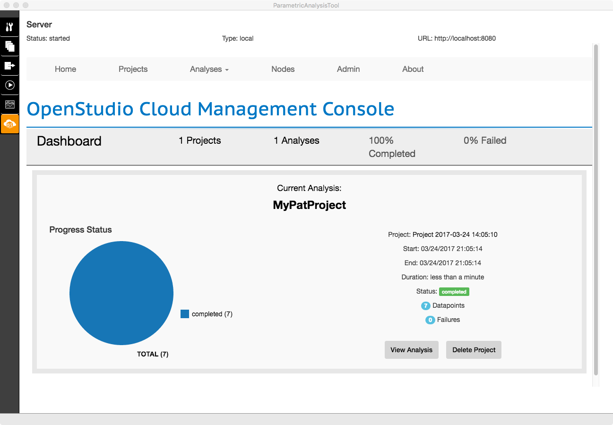

<h1>Parametric Analysis Tool 2.0 (PAT) Interface Guide</h1>
PAT removes the need to hand edit each model to try out different architectures, energy efficiency measures, and mechanical systems. PAT applies scripts to your seed model and lets you quickly compare many design alternatives.

___________________

## Create a Project
The functions of major tabs in PAT 2.0 are to:

1. Organize and edit measures for project
2. Select measures and create design alternatives
3. Request Outputs (future feature)
4. Run simulations
5. Create and view reports
6. View the server for diagnostics

*Above: At launch you can create a new project or open an existing one.*

You can move through the six vertical tabs on the left navigation by working in order from top to bottom.

To create a project click the "Make New Project" button. 

[comment]: # (remove restriction on spaces in path and projet name once that is fixed. Item #59 on 2.0 google doc.)

Note: The PAT 2.0 release requires that both the file name and path for the project doesn't have any spaces.

*Above: The "Make New Project" button takes you to a window to name your new project. After clicking "Continue" once the project is named, browse to the directory you want the project saved to.*

<iframe width="640" height="360" src="http://www.youtube.com/embed/a3lg7UbE6JU" allowfullscreen></iframe>

*Above: The video above shows the creation of a new project and gives a short introduction to the interface.*

___________________

## Load a Seed Model and Weather File
Select your seed model by clicking the folder icon for the "Defaul Seed Model". Select your weather file by clicking the folder icon for the "Defautl Weather File."

*Above: View of measures tab after browsing for both a seed model and a default weather file.*

[comment]: # (udpate documents and remove this once algorithmic workflow is added)

Analysis Type is currently limitied to manual. Algorithmic analysis will be enabled in a future version of PAT.

[comment]: # (haven't mentioned multiple seed files and epws here or on the desgin alternatives tab. Not sure if I should address at all now. Changing epws doesn't work, and I haven' tested multiple seed files.)
___________________

## Find Measures and Creating Measure Options for Project

If you want to learn more about measures, check out the [About Measures](../getting_started/about_measures.md) section.
Check out the [Measure Writing Guide](../reference/measure_writing_guide.md) and start writing your own custom measures.

There are three types of measures:

1. __OpenStudio measures__ are run on the OSM model before it is converted to an IDF.
2. __EnergyPlus measures__ can be run on the IDF file before it is handed to EnergyPlus.
3. __Reporting measures__ produce reports to chart results, provide quality assurance, and quality control on models.

The measures are applied to the model in order from top to bottom. You can reorder measure groups and always apply measures by using the gray arrows on the right.

### Add Measures to the Project from the Building Component Library (BCL)

Click the "+ Add Measure" buttons by the OpenStudio, EnergyPlus, or Reporting, to add find measures of that type for your project. The "Building Component Library" dialog that opens allows you to add both local measrues and BCL measures.

When the dialog allows you to filter by measure location, measure type, and measure category and sub-category. When it first opens it will have all location checked except from BCL (Online). It will also have only one measure type checked, based on which button you clicked in the measures tab. Nothing is checked by default in the "Category" section which has the effect of all categories showing. Once you check one or more categories or sub-categories only those will be shown. That filter will remain in place when you come back to this dialog in the future. So if you don't see the measure you expect check and make sure the category filters are setup correctly.

The measure locations are:

1. __My Project__ shows are measures that have already been added to your currently open project.
2. __Measure Directory__ shows measures you have authored in a user configurable directory on your machine.
3. __Local__ are local instnaces of the Online BCL measures that have already been downloaded to your machine.
4. __BCL (Online)__ will show all public measures on the Online Builidng Component Library. To use these in a project they should first be downloaded. 

*Above: Default view of BCL dialog when it first opens.*

To download measures click the black arrow that points down in the "Edit" column of the grid. Once the icon changes to the green document symbol the measure has been downloaded. It will typically move to the top of the list, but ou can click column headers to sort by other attributes. The image below shows the "Set Window to Wall Ratio" measure as downloaded from the Online BCL but no tyet added to the project. 

[comment]: # (remove this comment once the corrupted meaasure.xml issue is fixed. Item #64 on 2.0 google doc.)

Note: There is an issue in the December 2016 2.0 release that casues issues if you both download and add a measure to your project while in the same dialog session. To avoid this first download the measures from BCL, then close the dialog, then re-open the dialog to add the measures to your project. This is only an issue the first time you use a measure from BCL.

Clicking the blue plus icon will add the measure to your project. If there are online updates to a local BCL measure the "Update" column will have a clickable icon you can use to update your local measure.

*Above: Filtered View showing Online BCL OpenStudio Fenestration measures, and Set Window to Wall Ratio measure downloaded from Oneline BCL.*

After adding a measure to your project blue plus will change to a green checkmark. 

*Above: View of Set Window to Wall Ratio measure after being added to project.*

### Create Measure Options and Defining Variables

After closing the Building Component Library dialog measures are now loaded in the project. Individual measures can be moved up or down, and using the arows at the right. The "x" at the right will delete a measure from the project. The arrow at the left of each measures will let you expand and collapse the view into that measure.

*Above: View of measures tab after adding measure to project.*

Steps to complete measure options after adding measure to project using Builidng Component Library dialog:

1. Every measure that is in the project needs at least one measure option. You can create a measure option for a measure by clicking the __"Add Measure Option"__ button. This will add a column to the right side fo the grid for the measure.
2. Change default arguments and __add in missing argument values__ for the first measure option.
3. If you want to create additional measure options for this measure, then __click the "Variable" box__ for one or more measure arguments.
4. __Add additional measure options__ with unique variable combinations. 
5. __Rename measure option names__ to meaningful name for better reporting and diagonstics.

[comment]: # (remove this comment once change argument value issue is fixed. Item #63 on 2.0 google doc.)

Note: In PAT 2.0 you can't change measure arguments without checking the variable box. if you want to change a value but don't intend for it to be a variable then check it to change the value, then un-check it.

*Above: View of measures tab after adding measure to project.*

### Add the OpenStudio Results Reporting Measure to the Project

[comment]: # (remove this section if we start adding this measure to new projects automatically)

Always add the OpenStudio Results measure to the project, and to each design alternative. It is necessary to properly generate the Analysis Results Reports 

*Above: View of measures tab with all measures collapsed.*
___________________

## Create Design Alternatives

The second tab is used to create design alternatives. In the grid each row is a design alternative and each column is a measure. The cell value represents the measure option selected for a specific design alternative and measure. If the measure option value is set to "None" for a cell then that measure will be skipped in the workflow for that design alternative.

There are three ways to add design alternatives:

1. __Add Alternative__ creates a single design alternative with all the measure options set to "None".
2. __Create One Design Alternative with Each Measure Option__ will create a desgin alternative for each measure option that exists with all other measure option values set to "None"
3. __Duplicate Alternative__ duplicates an existing design alternative, as a starting point for a new desgin alternative.

You edit the measure option values after the measure has been created by clicking on a cell and using the pull down menu to select a different measure option or "None". You can delete a design alternative by clicking the "x" at the left of each row. 

You can also sort the rows by clicking on the column header or move individual rows by clicking the arrows near the left of the row. Currently the row order doesn't affect the order that the simulations are run or the results presented.

*Above: Populated design alternatives tab*
___________________

## Add Outputs

[comment]: # (update this section when algorithmic analysis type is added)

This tab is reserved for future use to setup objective functions and other output requests for algorithmic analyses.

___________________

## Run the Analysis

Clicking "Run Entire Workflow" will run all of the simulations. Make sure that "Server Status" has a green checkmark to the right instead of a red "x". It will take a few minutes after the application launches for the server to be ready. Generally you don't need to use the "Stop Server" or "View Server" buttons. There is only partial support in PAT 2.0 to run on the cloud, so most users will leave the "Run Locally" choice alone.
 
 
 
 *Above: View of Run Tab prior prior to running the analysis*
 
Soon after the analysis starts the progress bar will show "Analysis started" and a row will be added for each datapoint showing its current status. For local runs all but one of the processors will be used for parallel simulations.

 
 
 *Above: View of Run Tab while the analysis is running*
 
 After the simulation is completed for a desgin alternative you can expand it to view the log messages from the individual measures that run. The number of warnings adn errors and not applicables can be seen without expanding the design alternative. Reporting measure and EnergyPlus HTML files can be viewed by clicking the graph icon.
 
 There will be a short delay after the last simulation finishes before the progress bar displays "Analysis completed".
 
  
  
  *Above: View of Run Tab after siulations are complete*
___________________

## View Analysis Reports

OpenStudio 2.0 includes three different analysis reports. The analysis reports have access to high level data from all of the design alternatives, populated by reporting measures. This is why the OpenStudio Results reporting measure should be run for every design alternative. Below are breif summaries of the reports included with 

### Summary Table

This is a tabular report shwoing consumtpion, demand, and economic metrics for all of the design alternatives. Any design alternative can be set as teh "baseline" to which other design alternatives are compared to. The values shown in all but the top row are delta from the baseline values. This is similar to 1.x versions of PAT except that baseline selection is user configurable.

  
  
  *Above: Summary Table Analysis Report*

### End Use Comparison

This provides stacked bar charts by end use for each design alternatives, broken down by fuel.

  
  
  *Above: SEnd Use Comparison Analysis Report*

### EDAPT Export

This report should be used by modelers using utility based Energy Desgin Assistance Program Tool (EDAPT) workflows. This generate and xml report that can be uploaded to EDAPT websites.

  
  
  *Above: EDAPT Export Analysis Report*
___________________

## View the Server

This tab won't be necessary for most users, but can provide additonal functionality and diagnostics for advacned users. It provides an interface to the server the analysis is running on.

  
  
  *Above: Server Tab*

___________________

## Opening an Existing Project

You can open an existing PAT proejct when you first launch PAT or from the file menu. In either case it will open a dialog to browse to the path where you created your Project. There is no file to select, just browse to the top level project directory. This is different from 1x versions of PAT where there was a specific file to select.

  
  
  *Above: Open Project*
___________________

## Menu Bar Functions

- The File menu allows you to create a new project, open an existing project, save a project, or save as.
- You can set your "MyMeasures" directory and access server tools for diagnostics using the Window menu.
- Other menus won't be used by most users.
